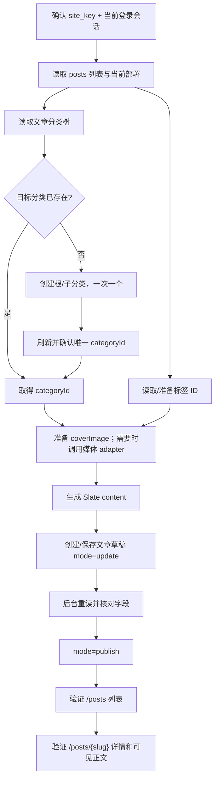

# AllinCMS 文章与分类操作逻辑

> 本页是文章内容对象的工作入口；媒体上传和 Markdown 正文图片绑定都必须从 [AllinCMS 唯一执行入口](AI-START-HERE.md) 开始。本文不保存真实 site key、site ID、文章 ID、媒体 ID、URL、action ID 或账号信息。

## 1. 先给结论

AllinCMS 文章不是“填标题后点发布”这么简单，而是一个有依赖顺序的内容对象：

```text
确认目标网站
→ 读取文章列表与当前 schema
→ 读取文章分类 / 标签及其 ID
→ 缺分类时先建分类并取得 categoryId
→ 缺封面时先走媒体 adapter，取得已验收的 HTTPS URL
→ 将正文转换为 Slate 节点数组
→ 创建或更新文章草稿
→ 重新读取后台记录并核对字段
→ 以 mode=publish 单独发布
→ 验收 /posts 列表、/posts/{slug} 详情和可见正文
```

核心判断：

1. **分类先于文章**：文章 payload 的 `categories` / `tags` 是 ID 数组，不是名称；分类与标签不能只写文本。
2. **图片先于封面绑定**：媒体上传与文章保存是两个对象动作。先完成媒体记录、公开 HTTPS、解码和刷新持久化，再把当前部署抓到的媒体对象写入 `coverImage`；不能默认把它简化成 URL。
3. **正文必须是 Slate**：`content` 不是 Markdown 字符串、HTML 字符串或本地文件路径，而是 Slate 节点数组。
4. **保存和发布分开**：`mode: "update"` 是草稿保存；`mode: "publish"` 才是发布。后端显示“已发布”仍不等于前台可访问。
5. **文章与产品不要共用 payload**：文章用 `title` / `excerpt` / `coverImage`；产品用 `name` / `description` / `media` / `specifications`。

## 2. 本轮现场核对与实测事实

### 2.1 文章列表

当前登录工作区的文章列表页为：

```text
https://workspace.laicms.com/{site_key}/posts
```

列表可见列：

```text
title | slug | excerpt | order | status | category | tags | created time
```

当前页面内嵌的 RSC 数据也将 `categories` 和 `tags` 表达为带 `id` / `name` 的对象数组。这证明列表展示的是分类、标签关联结果，而不是只有纯文本列。

### 2.2 文章编辑页

在一个已有文章草稿的只读编辑页上，核对到：

```text
正文 editor
标题              input name=title，placeholder=文章标题
Slug              placeholder=post-slug
标签              combobox，placeholder=选择标签
摘要              textarea，placeholder=简短摘要...
排序              integer，默认 0
封面图            点击选择图片
历史              UI 操作
更新              UI 操作
发布              UI 操作
```

当前草稿页显示摘要计数 `158/200`；这只能作为当前环境的 UI 约束证据，不能把 200 字硬编码成跨部署 API 契约。文章的分类关联在列表/RSC 数据和已捕获 payload 中成立，但本轮检查的这个草稿编辑 DOM 没有显式呈现“分类”控件，因此**不能假设当前部署一定能通过 UI 选择分类**；需要实际保存/抓包前再次核对。

### 2.3 本轮单篇文章接口闭环实测（2026-07-27）

在用户明确授权真实发布后，使用一个虚拟探针文章完成了以下闭环；公开知识库只保留去敏事实，不保存真实站点值、内部 ID、完整 action 值或账号信息：

- 文章列表的 `创建` 动作会立即创建远程草稿；本轮只创建一次，未重复点击。
- 从该文章更新页捕获到 `POST /{site_key}/posts/{post_id}/update`，请求体为单元素 JSON 数组，字段包含 `title`、`slug`、`excerpt`、`order`、`coverImage`、`categories`、`tags`、`content`、`siteId`、`postId`、`mode`。
- `content` 写入两段最小 Slate `p` 节点；先以 `mode: "update"` 保存，响应为 HTTP 200 / `text/x-component`，后台刷新后正文可见且状态为草稿。
- 将同一完整 payload 的 `mode` 改为 `"publish"` 后再次 POST，响应为 HTTP 200 / `text/x-component`；后台刷新后状态变为“已发布”。
- 前台 `/posts` 列表出现目标标题、摘要和详情链接；`/posts/{slug}` 详情返回 HTTP 200，标题、摘要和两段正文均出现在 DOM。
- 受控页面的 Playwright 隔离 evaluate 环境不提供 `fetch`；本轮通过同一登录页面的 CDP 主世界 `Runtime.evaluate` 发出同源请求，没有导出 cookie、token 或凭据。

本轮状态：`article_schema_read_only: verified`、`article_write_verified: true`、`post_update_publish: verified`、`frontend_list_detail: verified`。这里的“创建”是 UI `创建` 动作立即生成远程草稿的事实；**文章 create API 的完整请求合同没有在本轮重新捕获并回放，因此该动作仍保持 `BLOCK`**。分类创建、标签创建和封面绑定不在本轮最小探针范围内，但后续字段完整文章已验证已有 taxonomy ID 与真实封面绑定。

### 2.4 字段完整、真实封面、分类/标签和发布闭环（2026-07-27）

在上述最小探针之后，又使用同一真实登录会话完成了一次**字段完整的真实文章发布**。本次不新建分类、标签或媒体，而是复用已存在的文章分类、标签和媒体库图片，避免测试性重复创建。

已实际写入并验收的字段：

- `title`：英文长标题；
- `slug`：唯一的英文路由 token；
- `excerpt`：完整英文摘要；
- `order`：整数 `10`；
- `coverImage`：真实媒体库图片对象；
- `categories`：一个已有文章分类 ID；
- `tags`：四个已有标签 ID；
- `content`：16 个 Slate 节点，包含 `h2`、`p`、粗体 mark 等结构；
- `siteId`、`postId`：当前运行时内部 ID；
- `mode`：先 `update`，再 `publish`。

本次 `coverImage` 的**当前部署实测形状**为：

```json
{
  "name": "field-complete-cover.webp",
  "alt": "field-complete-cover",
  "type": "image",
  "source": "oss",
  "path": "{site_key}/normalized-cover.webp",
  "size": 6242,
  "mimeType": "image/webp"
}
```

这修正了旧文档中仅凭历史页面观察写下的 `source: "url"` / `url` 形状：**当前部署抓包以 `source: "oss"` + `path` 为准**。该对象形状属于部署相关合同，不能跨站点硬编码；每次应从当前媒体库记录或文章编辑页重新捕获。

实测结果：

- `mode=update` 返回 HTTP 200 / `text/x-component`；刷新后台后标题、slug、摘要、排序、分类、标签、封面和正文均持久化，状态为草稿；
- 同一完整 payload 只将 `mode` 切换为 `publish` 后再次 POST，返回 HTTP 200 / `text/x-component`；刷新后台显示“已发布”；
- 前台 `/posts` 列表出现标题、摘要、`Catalog & Content` 分类和真实封面图；
- 前台 `/posts/{slug}` 详情出现标题、摘要、正文第一节、四个标签和真实封面图；封面从 `assets.laicms.com` HTTPS 地址实际渲染。

本轮新增状态：`field_complete_payload: verified`、`cover_image_binding: verified_single_sample`、`category_and_tag_binding: verified_existing_ids`、`frontend_cover_render: verified_single_sample`。

### 2.5 文章分类页

文章分类入口位于文章模块的 `分类` tab，不应直接把产品分类页当成文章分类页。

当前分类树观察到：

- 已有分类以树状列表展示；
- 顶部工具栏有 `+`，语义为创建根分类；
- 每个分类行也有 `+`，语义为创建子分类；
- 当前版本的“新建分类”弹窗只有：`名称`、`Slug`、`创建`；
- 选择已有分类后，编辑面板还出现：`名称`、`Slug`、`描述`、`封面`；
- 创建动作本身才是远程写入，打开弹窗不等于已创建。

因此分类逻辑应拆成：

```text
读取分类树
→ 判断目标是已有分类、根分类还是子分类
→ 选择正确的 toolbar + 或 row +
→ 只填名称 + slug 创建
→ 刷新分类树并取得唯一 categoryId
→ 如需描述/封面，再进入分类编辑面板并单独验证
```

不要盲点行级 `+`：它可能创建子分类。不要连续提交多个分类：此前观察到交易号不同步错误；正确恢复是停止重复提交、刷新分类页、核对已经落地的分类，再逐个继续。

## 3. 文章字段合同

下面把字段分成“内容字段”“关联字段”“系统字段”和“只读/界面字段”，避免把页面展示值误当成保存 payload。

### 3.1 内容字段

| 字段 | 类型 | 语义 | 处理规则 |
|---|---|---|---|
| `title` | string | 文章标题 | 必填；用于后台标题、前台详情标题和通常的 H1。 |
| `slug` | string | 前台路由 token | 必填/强建议唯一；不要直接把公开 URL 当后台编辑 ID。 |
| `excerpt` | string | 列表/SEO 摘要 | 保持短；当前 UI 显示 200 字计数，但长度需按当前部署复核。 |
| `content` | Slate node[] | 正文 | 必须是节点数组；每个节点至少有 `type`、`children`、稳定/随机 `id`。 |
| `order` | integer | 列表排序 | 当前默认值为 `0`；不能用字符串替代数字。 |
| `coverImage` | object 或 null | 文章封面 | 使用媒体 adapter 验收后的当前部署媒体对象；无封面时可为 `null`，不要只写 URL 字符串。 |

### 3.2 关联字段

| 字段 | 类型 | 语义 | 处理规则 |
|---|---|---|---|
| `categories` | string[] | 文章分类 ID | 先读/建文章分类，再写 `categoryId` 数组；不要写分类名。 |
| `tags` | string[] | 文章标签 ID | 先读现有标签或完成标签创建/捕获，再写 ID 数组；编辑页有 `选择标签` combobox。 |

### 3.3 系统字段与动作字段

| 字段 | 类型 | 语义 | 处理规则 |
|---|---|---|---|
| `siteId` | string | 当前站点内部 ID | 每轮从当前准确站点上下文取得；不能硬编码或跨站复用。 |
| `postId` | string | 文章内部 ID | 更新/发布使用后台文章 ID；不能用 slug 代替。 |
| `mode` | `update` / `publish` | 保存动作 | `update` 保存草稿；`publish` 使用同一更新路由发布。 |

列表里出现的 `_status`、`createdAt`、`updatedAt` 是读取/验证字段，不应未经当前抓包证据直接塞进创建 payload。`历史`、`更新`、`发布`是 UI 控件，不是内容字段。

### 3.4 封面对象

当前部署的文章封面对象实测为媒体库对象，而不是简单的 URL 字符串：

```json
{
  "name": "cover.webp",
  "alt": "optional alt text",
  "type": "image",
  "source": "oss",
  "path": "{site_key}/normalized-cover.webp",
  "size": 6242,
  "mimeType": "image/webp"
}
```

`source: "oss"` + `path` 是本轮当前部署抓包得到的事实；旧的 `source: "url"` + `url` 只能作为历史/其他部署形状，不能继续当作默认合同。`path`、`size`、`mimeType` 的具体值必须从当前媒体库记录动态取得。`coverImage` 也允许在无封面场景为 `null`。

封面绑定的验收不是“payload 返回 200”就结束，而是：准确媒体页、媒体记录已存在、文章 update 后后台刷新仍有封面、publish 后前台列表和详情实际渲染图片、匿名 HTTPS、Content-Type 和图片解码均通过。

### 3.5 正文 Slate 最小形状

```json
[
  {
    "type": "p",
    "children": [{ "text": "一段正文" }],
    "id": "generated-node-id"
  }
]
```

现有实测页面还出现了带 `indent`、`listStyleType`、`listStart`、`listRestartPolite` 的列表节点，以及富文本 mark。批量导入时应把 Markdown 的标题、列表、粗体、链接、表格等转换为当前编辑器支持的结构化节点；不要把 `**bold**`、反引号或 Markdown 表格原样写成可见文本。

## 4. 分类、标签、文章的依赖关系



### 分类是否必须创建？

不是每篇文章都需要创建新分类。正确判断是：

1. 先读取当前文章分类树；
2. 如果已有合适分类，复用它的 `categoryId`；
3. 只有业务确实需要且没有合适分类时才创建；
4. 新分类创建完成并刷新确认后，才能进入文章 payload；
5. 不要为了让列表“看起来完整”而批量新建分类。

### 文章分类与产品分类是否共用？

不能默认共用。产品分类入口和文章分类入口是不同模块；当前文章 RSC 记录中的分类 ID 也应以文章模块当前数据为准。即便名称相同，也必须重新读取并确认 ID，不要把产品分类 ID 直接塞进文章。

## 5. JSON / Server Action 路径

### 5.1 请求形状

文章和分类属于内容对象，默认优先走“抓一次、回放 JSON”，而不是逐篇模拟 UI：

```text
POST 当前内容页路由
Headers:
  next-action: 当前部署对应的 action ID
  content-type: text/plain;charset=UTF-8
Body:
  [payload]
Response:
  text/x-component (Next Server Action flight)
```

当前已捕获的文章保存/发布路由形状为：

```text
POST /{site_key}/posts/{post_id}/update
```

文章 payload keys：

```text
title, slug, excerpt, order, coverImage, categories, tags,
content, siteId, postId, mode
```

动作表：

| 动作 | 语义 | 当前合同 |
|---|---|---|
| category create | 创建分类，返回 `categoryId` | 已捕获过 create 形状；当前部署仍需动态重抓 |
| post create | 创建文章草稿 | 已记录为 `postActions.create`；动作 ID 随部署漂移 |
| post update | 保存草稿 | `mode: "update"` |
| post publish | 发布 | 复用 update action，`mode: "publish"`，带全字段 |

Server Action 的 `next-action` ID、deployment、router tree、siteId 和 postId 都是运行时值，不能写死在公开 adapter 中。飞行响应不应假设 ID 固定在第一行；回放后应按 slug/siteId 重读后台记录确认。

### 5.2 为什么不直接点“创建”

文章列表的 `创建` / `创建文章` 在已验证版本中会**立即创建一个 Untitled Post 草稿**并进入 update 页面。它不是只打开空表单的无副作用按钮。除非用户已经授权创建远程草稿，探索字段时不要点它；优先读取已有草稿或现有文章。

如果已经获得创建授权，点击后应同时看：

- URL 是否进入 `/{site_key}/posts/{post_id}/update`；
- DOM 是否出现 `更新文章`、`草稿`、`Untitled Post`、编辑器和文章字段；
- URL 有短暂滞后时，以 DOM 状态和后台列表为准，不能重复点创建。

### 5.3 为什么正文不能用 UI 表单批量填

现有经验表明文章/产品 UI 表单的 Slate 编辑器绑定不适合直接作为批量作者路径；UI 保存可能把正文清空或保留旧模板残留。批量路径应：

```text
源资料 → article brief → Slate 转换 → JSON update/publish → 后台重读 → 前台 DOM 验收
```

UI 仅作为字段检查、单次抓包或没有安全 JSON 回放时的明确降级路径。

## 6. 发布与前台验收不是一件事

后端发布至少要分成四层检查：

1. 文章后台状态为 `已发布`；
2. 主题存在并启用了静态 `/posts` 列表页；
3. 主题存在并启用了动态 `/posts/{post}` 详情页；
4. 前台列表和详情 DOM 都出现目标标题、摘要/正文和预期图片状态。

只看到后台“已发布”、HTTP 200、页面 title 或列表链接都不够。详情页必须有可见文章正文；封面/正文图片的通过与否要单独记录，不能因为文章文字出现就默认图片绑定正确。

## 7. 运行前检查清单

### 只读探索

- [ ] 当前登录状态和准确 `site_key` 已确认；
- [ ] 已读取 `/posts` 列表列、状态和已有分类/标签；
- [ ] 未点击会立即创建草稿的 `创建`；
- [ ] 已读取已有文章编辑页字段；
- [ ] 已区分文章分类和产品分类；
- [ ] 已记录当前部署的字段差异和未确认项。

### 获得授权后的单条草稿

- [ ] 文章 brief、来源、slug、摘要和 Slate 正文已准备；
- [ ] 分类/标签 ID 已取得；
- [ ] 封面已通过媒体 adapter 完成全链验收，或明确决定无封面；
- [ ] 当前部署的 post save action 已重新捕获；
- [ ] 先保存 `mode=update`，后台重读通过；
- [ ] 再单独执行 `mode=publish`，后台状态通过；
- [ ] `/posts` 和 `/posts/{slug}` 前台 DOM 通过；
- [ ] 将文章、图片、失败、人工判断和最终 URL 写入私有运行记录；通用方法才回落公开母库。

## 8. 2026-07-27 分类、标签与文章生命周期接口实测

本轮在用户明确授权下，使用同一登录站点完成了分类、标签和文章生命周期的真实接口回放。公开知识库只保留去敏后的合同、字段语义和验收规则；站点值、内部 ID、认证头、完整 router state、完整 action ID 和真实测试 URL 保留在私有运行记录。

### 8.1 分类 create 合同

入口是文章模块的 `分类` tab。顶部 `+` 创建根分类；行级 `+` 创建子分类，二者请求体不同，不能混用。

```text
POST /{site_key}/posts?tab=categories
Content-Type: text/plain;charset=UTF-8
Body: [
  {
    "siteId": "<siteId>",
    "contentType": "posts",
    "name": "<category name>",
    "slug": "<category slug>",
    "description": "$undefined",
    "cover": null,
    "parent": "$undefined",
    "order": <next order>
  }
]
Response: 200 text/x-component
```

创建后必须刷新分类树，再从当前 RSC/列表数据读取唯一 `categoryId`。子分类请求的 `parent` 为父分类 ID，刷新后应同时满足：前台/后台树形缩进存在、列表记录的 `parentId` 指向父分类、底层节点数据的 `parent` 指向父分类。没有这三层证据时，不要仅凭名称相似判断父子关系。

### 8.2 分类编辑、隐藏、排序和删除

分类编辑仍使用文章分类页的同源 Server Action，payload 至少包含当前站点、内容类型、分类 ID、名称、slug、描述、封面和父级/排序相关字段；具体 action ID 必须运行时从当前部署捕获。

已通过接口闭环验证：

- **编辑**：名称、slug、描述更新后，刷新分类页仍为新值；
- **隐藏/恢复**：`visible: false` 后分类不可见，`visible: true` 后恢复；
- **排序**：使用分类页的批量排序 payload，`items` 逐项携带 `{ id, order, parent }`，刷新后顺序稳定；
- **删除**：删除请求为 `POST /{site_key}/posts?tab=categories`，body 是 `[ { id, siteId, contentType: "posts" } ]`；响应后刷新，目标分类消失。

分类删除只能用精确的当前分类 ID；不能用 slug、名称或排序序号代替。删除后必须检查分类树无临时测试子分类残留，且根分类/其他业务分类仍存在。

### 8.3 标签 create、编辑、删除和重复 slug

标签入口是文章模块的 `标签` tab，创建请求形状为：

```text
POST /{site_key}/posts?tab=tags
Content-Type: text/plain;charset=UTF-8
Body: [
  {
    "siteId": "<siteId>",
    "contentType": "posts",
    "name": "<tag name>",
    "slug": "<tag slug>",
    "description": "<optional description>"
  }
]
Response: 200 text/x-component
```

标签编辑请求形状为单个对象（不是删除用的数组）：

```json
{
  "siteId": "<siteId>",
  "contentType": "posts",
  "name": "<name>",
  "slug": "<slug>",
  "description": "<description>",
  "id": "<tagId>"
}
```

标签删除请求为：

```text
POST /{site_key}/posts?tab=tags
Body: [
  {
    "siteId": "<siteId>",
    "contentType": "posts",
    "id": "<tagId>"
  }
]
```

已通过接口编辑、刷新、删除和再次刷新核对。重复 slug 的当前语义是：表单在提交前显示“已存在相同的 slug”，本次重复提交不产生 POST；因此该错误语义属于客户端/表单校验路径，不能只用服务端 HTTP 结果推断。跨站点重复 slug 隔离仍需在另一站点获批后单独验证。

### 8.4 文章全字段保存、发布和重复发布

测试文章使用全字段 payload：

```text
title, slug, excerpt, order, coverImage, categories, tags,
content, siteId, postId, mode
```

正文保持 Slate node array；本轮包含标题、段落、列表、引用等节点和节点 ID。封面使用媒体库已验收的真实 WebP 对象，`source: "oss"`、`path`、`size`、`mimeType` 等字段直接取自当前媒体记录，不能猜路径。

| 轮次 | 动作 | 接口结果 | 刷新后检查 |
|---|---|---|---|
| A | 全字段 `mode: "update"` | HTTP 200，`text/x-component` | 标题、slug、摘要、排序、分类、标签、正文、封面存在；状态为草稿 |
| B | 同一完整 payload 重复 `update` | HTTP 200，`text/x-component` | 不重复创建文章或 taxonomy，正文和封面不丢失 |
| C | 修改摘要、排序和正文后 `update`，再 `publish` | 两次 HTTP 200 | 修改后的字段持久化，后台状态为已发布 |
| D | 同一完整 payload 重复 `publish` | HTTP 200，`text/x-component` | 没有生成第二篇同 slug 文章，前台仍只有一篇目标文章 |

前台列表和详情均重复打开验证。标题、摘要、分类、Slate 正文和真实封面均出现；当前主题不把标签渲染为可见文本，因此标签的通过证据以后台刷新/RSC 绑定为准。

### 8.5 文章取消发布、恢复发布和删除

文章更新路由保持：

```text
POST /{site_key}/posts/{postId}/update
Body: [完整文章 payload]
```

在已捕获完整文章 payload 上，仅切换 `mode`：

- `mode: "unpublish"`：接口 HTTP 200；后台刷新后状态为“草稿”；
- `mode: "publish"`：接口 HTTP 200；后台刷新后恢复“已发布”，前台详情页可访问并渲染正文、分类、摘要和封面；
- `mode: "update"`：保留为普通草稿保存，不应被误当成发布或取消发布。

文章删除使用文章列表页的同源动作：

```text
POST /{site_key}/posts?tab=list
Body: [
  {
    "id": "<postId>",
    "siteId": "<siteId>"
  }
]
```

本轮先拦截一次 UI 删除请求以捕获合同，再通过接口实际发送一次删除请求，避免在请求形状未确认时误删。删除后后台刷新目标文章行消失；原前台详情 URL 返回主题 404。删除验收以后台记录消失 + 前台 404 为准，不能只看 HTTP 200。

### 8.6 复杂 Slate 节点与主题渲染边界

本轮又用编辑器 UI 做了一次只为捕获合同的无序列表变更，并从当前部署的真实保存请求读取到以下去敏节点形状：

```json
{
  "type": "ul",
  "listStyleType": "disc",
  "children": [
    {"type": "li", "children": [{"text": "无序列表第一项"}]},
    {"type": "li", "children": [{"text": "无序列表第二项"}]}
  ]
}
```

有序列表对应的关键字段为 `type: "ol"`、`listStyleType: "decimal"`、`listStart: 1`，子节点仍为 `li`。因此批量文章转换不能只写两个嵌套 `div`，也不能把 `ul`/`ol` 当作普通段落文本；应优先采用当前编辑器实际产生的节点合同。

正文图片的当前保存节点为 `type: "img"`，至少包含 `url`、`alt`、`children: [{"text": ""}]` 和 `id`。本轮 payload 中的 `alt` 会被后台保存，但当前主题前台把图片渲染为 ``；同样，`ul`/`ol` 文本可见，但当前详情页 DOM 统计为 `ul=0`、`ol=1`，无序列表容器实际是嵌套 `div`。这应记录为**主题渲染/无障碍表现缺口**，不能倒推成接口未保存。

复杂 Slate 的验收分两层：

1. **CMS 数据层**：后台刷新仍有节点、文本、marks、链接、真实图片 URL 和完整图片字段；
2. **主题表现层**：前台逐项检查语义标签、链接 target、图片匿名 HTTPS/MIME/解码、列表视觉和无障碍属性。

当前部署已通过数据层与视觉内容层，但无序列表语义标签和正文图片 `alt` 前台透传仍开放；发布前若要求严格无障碍，需要主题渲染器单独修复或建立明确的降级说明。

### 8.7 稳定性与创建边界

本轮分类、标签和文章均按“单次动作 → 等待响应 → 刷新 → 重读确认”的节奏执行。分类/标签创建在连续动作或 transaction state 不稳定时曾出现：

```text
Given transaction number ... does not match any in-progress transactions
```

这说明当前部署的创建动作对 transaction state 敏感。后续 SOP 固定为：

```text
单次创建
→ 等待响应
→ 刷新
→ 重读唯一记录
→ 再进行下一次创建或文章绑定
```

出现交易号异常时停止，不重复发送状态不明的创建请求；先刷新并重读，确认远端没有创建后，才允许人工决定是否重试。

### 8.8 11 篇文章串行稳定性实测

本轮在当前部署继续做了 11 篇临时文章的真实接口长跑，详见 [11 篇文章纯接口串行验证](direct-serial-11-article-verification.redacted.md)。每篇文章都使用完整字段，包含真实 WebP 封面、结构化 Slate 正文和正文图片；严格按单篇 `update → publish` 完成后台刷新与前台详情验收。

- 11/11 完整 payload 保存成功；
- 11/11 发布成功，后台刷新均为“已发布”；
- 前台 11/11 标题、正文和列表文本通过；
- 55/55 图片加载并解码，11/11 封面为 1200×800 WebP；
- 11/11 临时文章已清理，后台刷新后目标标题全部消失；
- 中途一次批量 CDP 调用超时，没有重发，先回读后台确认远端状态，再继续只读验收。

这使“超过 10 篇文章仍未验证”改为：**当前部署已完成 11 篇串行真实接口验证；任意更大批次、限流、中断恢复和失败回滚仍开放。**

## 9. 当前已闭合项与剩余边界

本轮已闭合：

- 分类：编辑、隐藏、恢复、排序、根/子分类 `parent`、删除；
- 标签：编辑、删除、重复 slug 的前置校验语义；
- 文章：全字段 `update`、重复 `update`、`publish`、重复 `publish`、`unpublish`、恢复发布、删除；
- 真实封面：从媒体库取得完整对象，后台刷新、匿名 HTTPS、MIME 和图片解码验收；
- 清理：本轮临时测试文章、临时标签、临时子分类已删除并刷新核对；列表中另有既存且明确标注“勿发布”的虚拟草稿，本轮未改动；保留一个用于验证编辑/隐藏/排序的根分类测试记录，未混入文章删除测试。

仍待验证或不应被本轮结果替代：

- 跨部署封面对象和 action 合同漂移；
- Slate 链接、正文图片、表格和复杂 marks 的跨部署兼容性；
- 503、交易号异常、失败重试、回滚和跨请求幂等恢复；
- 任意更大批次文章的真实远程串行长跑、限流、中断恢复和全量对账；
- 跨站点 taxonomy 隔离。

因此当前结论分层记录：**当前部署的字段、taxonomy、文章生命周期和 11 篇串行真实接口闭环已有证据；本地 Adapter 已补齐状态不明恢复、分类/标签 CRUD 和 50 条串行控制器测试；跨部署、失败注入的远程证据、任意大批量远程长跑和主题语义缺口仍保持 BLOCK。**
## 10. Markdown 正文图片原位绑定合同（2026-07-27）

文章正文图片已经形成独立 adapter，不再允许由执行 AI 临时拼 payload：

- [article-image-binding.mjs](article-image-binding.mjs)：唯一实现；
- [article-image-binding-contract.json](article-image-binding-contract.json)：机器合同；
- [article-image-binding.test.mjs](article-image-binding.test.mjs)：本地故障测试；
- [AI-START-HERE.md](AI-START-HERE.md)：其他 AI 的唯一执行入口。

### 10.1 资产与出现位置必须分层

同一图片字节只建立一个 `asset`，以源 SHA-256 为主键；图片每次出现在文章中都建立独立 `occurrence`：

```yaml
asset:
  owns: [source_sha256, source_md5, media_id, public_url]
occurrence:
  owns: [source_start, source_end, block_index, before_anchor, after_anchor, role, article_context, alt, caption]
```

因此 `段落 → A → 段落 → B → 段落 → A → 段落` 中，A 只上传/映射一次，但第一处 A 与第三处 A 仍是两个 occurrence。禁止按文件名模糊匹配、全局替换和跨 occurrence 共享页面语境元数据。

### 10.2 Slate 图片节点硬合同

正文图片节点至少满足：

```json
{
  "type": "img",
  "url": "https://assets.example.invalid/{site_key}/image.webp",
  "alt": "与该出现位置相关的替代文本",
  "caption": [{"text": "可见图片说明"}],
  "children": [{"text": ""}],
  "id": "unique-node-id"
}
```

关键边界：

- `caption` 必须是 Plate/Slate 文本节点数组，不能是字符串；
- 每个节点必须有稳定且不重复的 `id`；
- `children` 必须存在并至少包含空文本节点；
- 图片 URL 必须是已复核的 HTTPS；
- 非装饰图必须有后台 Alt；
- 源 Markdown 哈希、图片 token 字符位置和前后锚点任一变化，都必须重建清单，不能沿用旧绑定。

真实虚拟草稿第一次使用 `caption: "文字"` 时，Server Action 返回 200 且后台回读字段一致，但编辑页出现 500。改为 `caption: [{"text":"文字"}]` 后，同一草稿重载恢复并再次只读复验通过。这证明“请求 200 + 数据回读”不足以判定文章保存完成。

### 10.3 唯一执行顺序

```text
打开精确媒体页并确认登录 / site key
→ 创建 schema 2 文章图片清单，每个 occurrence 独立记录绝对源路径、SHA-256、MD5、位置和语境
→ 逐资产复用或严格串行上传
→ 逐资产复核媒体记录、HTTPS、MIME、签名和浏览器解码
→ 生成 bound Markdown 供审阅，但不做远程保存
→ 打开精确文章 update 页面并确认 post ID 与本次草稿保存授权
→ 只调用 bindAndSaveAllinCmsArticleDraftDirect()
  → 逐 occurrence 串行复核本地源图
  → 逐 occurrence 原位绑定 URL、Alt、Caption 并显示进度
  → audit 全部为 0，生成 bindingProof
  → 保存边界再次逐 occurrence 串行复核
  → 整篇只发一次 mode=update 保存请求
  → 后台完整回读
  → 编辑页重载、图片解码和 Caption 可见检查
  → operation lock 内原子写清单
```

`onProgress` 只展示逐 occurrence 校验和内存绑定，不代表逐图远程保存。无论正文图片数量多少，文章远程写入都只能整篇一次。含图片正文不得直接调用 `saveAllinCmsArticleDraftDirect()`，不得手写 Slate / `bindingProof`，不得绕过 `${manifestPath}.${siteKey}.${postId}.operation.lock`。不同源资产不得共用同一 media ID 或 URL；schema 1 和缺失 occurrence 源哈希的旧清单必须重建。

保存后只要请求可能发出，就禁止自动重发。出现 500 时返回 `article_editor_render_failed`，保留 `requestMayHaveSucceeded: true` 和 `automaticRetryAllowed: false`；先只读确认远端状态，再由人决定是否用修正后的 payload 进行新的草稿更新。

### 10.4 A/B/A 草稿实测结论

本轮只修改已授权的虚拟测试草稿，未发布：

```yaml
unique_assets: 2
image_occurrences: 3
same_asset_reused_at_occurrence_1_and_3: true
backend_order_matches: true
backend_positions_match: true
backend_urls_match: true
backend_alt_persisted: true
backend_caption_persisted: true
editor_reload_healthy: true
editor_images_decoded: 3_of_3
editor_captions_visible: 3_of_3
published: false
```

Alt 必须按三层报告：

```yaml
backend_alt_field: persisted_and_read_back
editor_dom_img_alt: missing_observed_3_of_3
published_theme_alt_current_run: not_run_not_authorized
```

本页前文记录过其他历史发布探针的主题表现，那些证据不能替代本次 A/B/A 草稿的公开主题验证，也不能用来宣称当前主题或未来部署已经正确输出 SEO Alt。

### 10.5 清单锁恢复

文章全流程使用 `${manifestPath}.${siteKey}.${postId}.operation.lock`，最终清单原子写入另使用 `${manifestPath}.lock`。冲突时默认停止，不得直接删除。只允许在私有运行区确认以下条件后人工恢复：

1. 锁已超过当前运行合理时长；
2. 没有打开锁文件的句柄；
3. 没有活动写进程；
4. 没有待 rename 的临时文件，或临时文件状态已被人工判定；
5. 目标清单当前状态已核对；
6. 恢复动作留下私有证据。

不得把“发现空锁就删除”写成自动策略；锁存在优先保护潜在活动写者。


## 11. 对抗审查收口（更新于 2026-07-29）

本节区分“代码控制器已通过”与“当前远程部署已证明”，不把本地测试或历史真实运行外推成跨部署承诺。

| 范围 | 当前结论 | 证据 / 缺口 |
|---|---|---|
| 当前知识库 Adapter：文章字段、taxonomy、状态机、恢复和串行控制 | **PASS（本地控制器）** | `npm test`：131/131 通过；其中正文图片 50/50、媒体 45/45，文章生命周期与 taxonomy 36/36，覆盖全字段、状态冲突、动态 action、精确创建 ID、taxonomy snapshot、重复 slug、受控重试和人工介入 |
| 当前部署历史真实文章闭环 | **PASS（限定范围）** | 已有当前登录站点、动态捕获 action、严格串行 11 篇 `update → publish`、后台/前台/图片验收证据 |
| `postCreate` API | **BLOCK** | 代码已 fail-closed 实现，但本轮没有新的远程 `postCreate` 捕获、精确 `postId` 回读和 replay 证据；必须先重新捕获当前部署合同，才可传 `createContractConfirmed: true` |
| 503、transaction mismatch、请求可能成功后的文章恢复 | **BLOCK** | 只有本地故障控制测试，没有文章级远程注入证据；状态不明时 adapter 只允许停下，不会盲重发 |
| 跨部署 / 跨站点 taxonomy 隔离 / 任意大于 11 篇远程长跑 | **BLOCK** | 尚未形成对应的当前会话实测证据 |
| 主题语义与无障碍表现 | **BLOCK（产品表现层）** | 当前主题的无序列表语义和正文图片 `alt` 透传仍有缺口；不是重复 API 请求能够修复的字段合同问题 |

本轮不把“敏感问题”作为阻断项；保留的 BLOCK 都是证据、合同、恢复或表现层边界。任何一个 BLOCK 未补证据前，整体不能标记为 PASS。

## 结构化 mutation authorization

`article-operations.mjs` 和 `article-image-binding.mjs` 的远程写入口要求 `authorizationContext`，裸布尔授权会在请求前 fail closed。上下文由 `mutation-authorization.mjs` 创建，精确绑定站点、operation、目标 SHA-256 摘要、具名 `human-asserted` actor、`approved_at` 和最长 30 分钟的 `expires_at`；每次发送前重新验证。`approval_identity_status: not_verified` 是固定边界，不能据此宣称真人身份、publish/delete 批准、跨部署稳定或正式发布。
