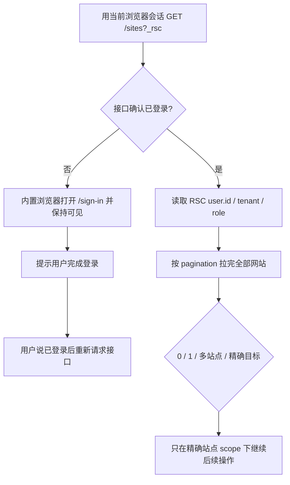

# AllinCMS Workspace API-first 前置检查

## 结论

前置检查现在按下面顺序执行：



页面 DOM 只用于登录交接和异常诊断；登录状态、用户 ID 与网站列表以当前接口回包为准。历史聊天、旧标签页、旧站点 key 和只看 HTTP 200 都不能替代这次检查。

**“复用内置浏览器登录会话”不等于“导航或打开 `/sites` 页面”。** 正常已登录分支必须复用现有 AllinCMS 同源标签页，在后台通过 CDP `Runtime.evaluate` 执行 credentialed `fetch`；不得调用 `goto()`、不得切前台、不得用页面卡片代替 RSC。只有接口已经明确返回 `login_required`，才允许调用 `openLoginPage()` 并显示 `/sign-in`。若当前完全不存在可复用的 AllinCMS 同源上下文，宿主最多只能新建一个**后台 session transport 标签页**以取得同源执行环境，不得把它当成 UI 工作流或点击入口。

## 1. 如何获取当前用户 ID

只读请求：

```http
GET https://workspace.laicms.com/sites?_rsc={nonce}
Accept: text/x-component
RSC: 1
Credentials: 当前已登录浏览器会话
```

从 RSC Workspace 布局数据读取：

```text
user.id       当前 AllinCMS 用户 ID
user.tenant   当前租户 ID
user.role     当前权限角色
user.name     展示名称
user.email    登录邮箱
```

`user.id` 是唯一认可的当前用户 ID 来源：不能从邮箱推导，也不能拿外部认证服务的 ID 替代。真实 ID、邮箱、Cookie、Token 不写入母库、公开子库或 fixture。

## 2. 如何获取完整网站列表

同一 RSC 返回：

```text
data[].id
data[].name
data[].description
data[].slug
data[].domains
data[].displayDomain
data[].active
data[].themeCount
data[].createdAt
pagination.page / limit / totalDocs / totalPages / hasNextPage / hasPrevPage
canCreate
```

如果 `totalPages > 1`，必须逐页请求，按站点 `id` 去重，并验证最终数量等于 `totalDocs`。只读第一页时，结果必须标记 `pagination_incomplete`，不能宣称“已获取全部网站”。

站点选择 fail-closed：

- 0 个：`zero_sites`；
- 1 个：`single_site`，仍需把精确站点回显给操作者；
- 多个：`multiple_sites`，不得猜；
- 用户给了 `id`、`slug` 或 `displayDomain`：只接受完全相等；找不到为 `target_not_visible`；
- Tony 已删除的历史站点只是不再出现在当前列表，不构成异常，也不能继续沿用旧 scope。

## 3. 浏览器 transport 与可见导航边界

正常前置检查的 transport 规则固定为：

1. 优先复用当前内置浏览器中已有的 `workspace.laicms.com` 同源标签页；
2. 直接在该标签页上下文后台执行 `fetch`，不改变当前可见 URL、不切前台、不点击；
3. 已登录、`http_error`、`contract_drift`、`pagination_incomplete` 等非 `login_required` 结果都**不得**触发登录页 opener；
4. 只有没有任何同源执行上下文时，才允许创建一个不前台展示的 transport 标签页；这只是接口载体，不是页面操作；
5. 是否登录仍由新鲜 RSC 回包判断，不能因为 transport 标签页存在就推断登录。

这次发生“先打开 `/sites` 再检查”的根因属于宿主编排错误：把浏览器 Cookie/session transport 与可见页面导航混为一谈；不是 AllinCMS 接口要求，也不是 Adapter 的正常流程。

## 4. 未登录时如何交接

接口出现 401/403、最终 URL 为 `/sign-in`，或返回登录内容而不是 Workspace RSC 合同时：

1. 宿主必须用**内置浏览器**打开 `https://workspace.laicms.com/sign-in`；
2. 登录页保持可见并切到前台；
3. 立即提示：`AllinCMS 后台尚未登录。我已打开登录页，请完成登录；完成后告诉我“已登录”，我会重新通过接口检查当前用户和网站列表。`；
4. 用户完成登录后，重新执行 GET `/sites?_rsc`；
5. 不复用旧响应、旧用户、旧网站列表或旧站点选择。

`runAllinCmsWorkspacePreflight()` 接受宿主注入的 `openLoginPage(url, options)`；检测到未登录时会调用它。若宿主没有提供该能力，结果会明确返回 `hostActionRequired: open_login_in_in_app_browser`，不能假装已经打开。

## 5. 新增网站是什么 API

当前部署不是公开 JSON REST endpoint，而是 Next.js Server Action：

```text
Action name: createSiteAction
Method: POST
Route: https://workspace.laicms.com/sites
Accept: text/x-component
Next-Action: 当前页面脚本动态发现的 opaque 十六进制 action ID（当前观测为 42 位，长度不可硬编码）
Next-Router-State-Tree: 当前 /sites 页面动态值
x-deployment-id: 当前部署存在时携带
Credentials: include
```

客户端只提交一个 action argument：

```json
[
  {
    "name": "Example B2B Site",
    "description": "Industrial product and application content."
  }
]
```

这是普通字段时 React Flight `encodeReply()` 的 wire shape。`user.id`、`tenant`、`role` 不在客户端 payload 中，由服务端当前 session 注入；站点 `id`、`slug`、默认域名和默认 setup 也由服务端生成。

### 新增网站字段

| 字段 | 必填 | 当前前端约束 | 说明 |
|---|---:|---|---|
| `name` | 是 | string，2–50 字符 | UI 名称“名称”，placeholder“站点名称” |
| `description` | 否 | string，最多 200 字符 | UI 名称“描述”，placeholder“站点简介”，默认空字符串 |

除 `name`、`description` 外，当前客户端 create action 不接受其他业务字段。`workspace-preflight.mjs` 会拒绝未知字段，防止误把用户 ID、tenant、slug 等服务端字段塞入 payload。

### 为什么不能永久硬编码 action ID

`Next-Action`、router tree 和 deployment ID 会随部署或页面状态变化。Adapter 只提供动态发现和请求构造器，不把真实 action ID 写入公开合同或 fixture。实际创建前必须从当前已登录 `/sites` 页面重新发现并绑定这三个值。

## 6. 创建后的验收边界

本次只读探索没有创建网站。后续只有在得到针对当前站点名称和描述的明确授权后，才能调用 mutation。成功不能只看 HTTP 200 或 toast，至少要：

1. 创建前保存完整网站 ID 集合；
2. 严格串行调用一次 create action；
3. 刷新并拉完完整网站列表；
4. before/after 唯一差集必须恰好出现 1 个新站点 ID；
5. 回读新 `slug`、`displayDomain`，打开精确后台和默认前台；
6. 如果 `data.setupError` 存在，只能报告“站点记录已创建但默认 setup 不完整”，不能报完整成功。

当前只读代码能确认 UI 成功回调读取 `result.data` 和可选 `data.setupError`，错误回调读取 `result.error.serverError`；更细的成功字段和全部服务端默认记录仍须在获批的真实创建中验证。
