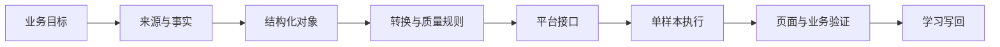

# 建站内容运营的底层模型

## 先记住一句话

**内容不是一段文字，建站也不是把文字粘进后台。**

建站内容运营的稳定工作是：把公司、产品和客户问题转成结构化、可验证、可发布、可复用的数据，再通过某个工具接口送到网站，并验证它是否真的帮助客户理解、比较和行动。



## 1. 稳定对象是什么

| 对象 | 它真正代表什么 | 最低要求 |
|---|---|---|
| 公司知识 | 为什么客户可以信任你 | 来源、能力、市场、证明、限制、更新时间 |
| 产品知识 | 客户买的不是名称，而是问题解决方案 | 规格、应用、差异、约束、证据、状态 |
| 客户语言 | 客户如何描述任务、痛点、异议和风险 | 原始表达、场景、决策阶段、验证状态 |
| 内容 brief | 一页内容为什么存在 | 目标买家、搜索/决策意图、问题、答案、证据、CTA |
| 图片资产 | 具有身份和使用条件的数字资产 | 文件、产品归属、用途、权利、alt、公开 URL、状态 |
| 发布记录 | 一次可审计的外部变更 | 目标、时间、操作者、输入、结果、失败、回滚、真实 URL |
| 反馈数据 | 判断内容是否有用的证据 | 抓取、索引、曝光、点击、询盘、销售反馈或人工验证 |

## 2. CMS 和图床本质是什么

- **CMS** 是内容对象的存储、状态管理和发布接口。无论按钮叫什么，核心都在处理字段映射、草稿/发布状态、权限、更新、删除和页面 URL。
- **图床或媒体库** 是图片资产的存储与公开访问接口。核心不是“上传成功提示”，而是文件身份、权限、公开 URL、引用关系和失效恢复。
- **Obsidian** 是本地 Markdown 知识库的一种查看和编辑方式，不是知识库本身。
- **Codex 或其他 AI agent** 是调查、映射、生成、执行和验证的助手，不是事实来源，也不能替代人工审批。

工具通常只是在以下接口中选一种或组合：

- GUI；
- API；
- CSV / Excel 导入；
- CLI；
- MCP；
- 浏览器自动化。

工具变化时，替换接口和 adapter；公司、产品、客户、内容、图片、发布和验证模型不应重写。

## 3. AI 如何接手陌生工具

把下面提示词交给 AI：

```text
请先识别这个工具解决什么业务问题、它的核心对象和字段，
以及支持 GUI、API、CSV、CLI、MCP、浏览器操作中的哪些接口。
然后读取本子库的 MENTAL-MODEL.md、模板和质量闸，
产出“稳定对象/字段 → 该工具对象/字段/操作”的映射表。
请同时标明认证方式、权限、批量限制、幂等、回滚和验证方法。
先做一个样本，验证输入、输出、权限和回滚；我确认后再批量。
不要先让我照着按钮教程操作，也不要把点击成功当作业务成功。
```

AI 至少要交付：

1. 工具解决的问题与适用边界；
2. 核心对象、字段和状态；
3. 可用接口及选择理由；
4. 稳定模型到平台的字段映射；
5. 权限、凭据和审批边界；
6. 单样本方案、预期结果和回滚；
7. 成功证据与失败诊断路径；
8. adapter 中需要记录的易变操作。

## 4. 为什么先做一条小样

单样本不是为了保守，而是为了低成本验证五件事：

- **语义**：字段是否映射正确；
- **格式**：文字、图片和结构是否被平台正确接收；
- **权限**：当前账号是否只能草稿，还是可以覆盖、删除或发布；
- **可见结果**：后台状态与真实前台页面是否一致；
- **可恢复性**：失败后能否重试、跳过、撤回或回滚。

只有这五项有证据，才具备批量资格。

## 5. 参考实现与课程本体的边界

本子库会演示：

- 用 Obsidian 查看本地 Markdown；
- 用 Codex 读取、整理和执行；
- 用 PicGo 完成图片单图与批量上传；
- 用一个具体 CMS 完成字段映射、草稿、发布和验证。

这些是**参考实现**。真正要学会的是：即使换成另一 Markdown 编辑器、另一图床、另一 CMS 或另一 AI，也能重新建立映射并跑通同一闭环。

## 6. 迁移练习

完成参考实现后，必须再选择一个陌生工具：

1. 不看本子库旧按钮步骤，先让 AI 调查对象、字段、接口和限制；
2. 产出字段与状态映射；
3. 选择最安全接口；
4. 只导入一张图片、一个产品或一篇文章；
5. 对照真实页面和记录验收；
6. 写出失败诊断与回滚；
7. 只把工具特有步骤写进新 adapter。

如果只能复现 PicGo 或某个 CMS，却不能完成上述迁移，本课程仍未通过。

## 7. 迁移到相邻业务任务

建站形成的公司、产品、客户语言和证明资产还可以成为 SEO/GEO、社媒、主动营销和销售沟通的共同输入，但不能原样复制网站产物。迁移时重新回答：

| 需要重映射的问题 | 示例 |
|---|---|
| 谁在什么情境下接收 | 搜索用户、LinkedIn 浏览者、冷邮件收件人 |
| 他要完成什么任务 | 学习、比较、验证供应商、回复或预约 |
| 渠道允许什么形式 | 页面、短帖、邮件、私信、广告 |
| 哪些证明最合适 | 参数、案例、认证、FAQ、客户原话 |
| 什么算成功 | 索引/询盘、互动、回复、会议、成交信号 |
| 权限和风险是什么 | 发布审批、账号安全、退订、频率和平台规则 |

共享的是知识底座、客户问题和证据；变化的是渠道表达、接口、权限和验证指标。用户能完成这种重映射，才具备从“会做建站”到“会借助 AI 上手相邻业务”的能力。
