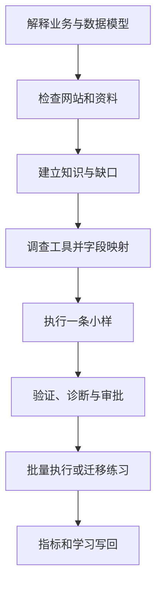

# 建站内容运营 Playbook

## 全流程



## 阶段 0：解释底层模型

执行前先读 `MENTAL-MODEL.md`。AI 要能向用户说明：

- 业务目标和客户任务；
- 公司、产品、客户语言、内容、图片、发布记录和反馈数据之间的关系；
- 哪些是稳定模型，哪些只是当前工具的操作方式；
- 为什么必须先做单样本、真实页面验证和回滚准备。

如果只能给按钮步骤，不能解释对象、字段和判断标准，不进入后续阶段。

## 阶段 1：建立客户运行区

复制 [WORKSPACE-TEMPLATE/](WORKSPACE-TEMPLATE/README.md) 为每个使用者创建独立 `workspace/`，至少包含：

```text
workspace/
├── 00_intake/
├── 10_sources/
├── 20_knowledge/
├── 30_tasks/
├── 40_outputs/
├── 50_metrics/
└── 90_writeback/
```

公开包可以包含空的 `WORKSPACE-TEMPLATE/`，但不得包含填入真实数据的 `workspace/`，也不得自动回传客户运行数据。

## 阶段 2：检查网站和资料

按 `INTAKE.md` 扫描来源，并使用 `TEMPLATES/source-register.md` 建立来源登记和事实表。先读后问，优先复用网站已有信息。

完成闸：

- 关键事实能追溯；
- 冲突和过期信息已列出；
- P0 缺口已回答或明确阻塞；
- 选定一个产品、一篇文章或一张图片作为小样。

## 阶段 3：建立稳定知识对象

使用：

- `TEMPLATES/company-profile.md`
- `TEMPLATES/product-record.md`
- `TEMPLATES/customer-voice-to-content.md`
- `TEMPLATES/article-brief.md`
- `TEMPLATES/image-manifest.md`

内容状态必须保留，不得把推断自动升级为确认。工具变化时，不重写这些稳定对象，只重做接口映射。

## 阶段 4：设计内容

文章和产品页不从关键词开始堆字，而从客户任务开始：

- 客户是谁；
- 他正在解决什么问题；
- 他会如何描述问题和搜索；
- 当前处于了解、比较、验证还是采购阶段；
- 哪些公司和产品事实能真正回答；
- 哪些证据支持；
- 下一步 CTA 是什么。

聊天、询盘和销售异议可以形成搜索意图假设，但必须与站内搜索、Search Console、关键词工具、销售反馈或页面数据交叉验证。

## 阶段 5：调查工具并建立 adapter

不要先找按钮。先完成：

1. 工具解决什么业务问题；
2. 核心对象、字段和状态；
3. 支持 GUI、API、CSV、CLI、MCP、浏览器操作中的哪些接口；
4. 认证、权限、速率、批量、幂等和回滚限制；
5. 使用 `TEMPLATES/tool-field-map.md` 完成“本子库稳定字段 → 平台字段 / 操作”的映射；
6. 单样本的输入、预期输出、成功证据和失败处理。

工具特有内容使用 `ADAPTERS/_template.md` 写进 `ADAPTERS/`，稳定规则不写成某个平台的按钮教程。

## 阶段 6：参考实现——图片

1. 根据 `TEMPLATES/image-manifest.md` 确认图片身份、来源、使用权、产品归属和用途；
2. 统一文件名、尺寸、格式和 alt；
3. 先用 [图片上传统一路由](ADAPTERS/image-upload-routing.md) 判断目标是 AllinCMS 媒体库还是外部图床；
4. 目标为 AllinCMS 时，运行环境预检并调用 `uploadAllinCmsMediaSerial()`；不先配置 PicGo；
5. 每张完成接口上传、自动刷新、media ID / URL / 匿名访问 / 解码验证和原子索引后，才进入下一张；
6. 上传报错先延迟并只读对账；确认远端不存在才有限重试当前图片，对账不明确、索引失败、锁冲突或接口漂移立即停止；
7. 只有需要 CMS 解耦 URL、跨系统复用、迁移练习或用户明确指定时，才使用 PicGo + R2 / GitHub / COS / OSS。

AllinCMS 是当前首个图片参考实现；PicGo 与外部图床是独立备选和迁移练习。换工具时重复“调查 → 映射 → 单图 → 验证”，不降低同一验收标准。

## 阶段 7：参考实现——CMS

1. 读取 `ADAPTERS/README.md` 并调查当前 CMS；
2. 建立产品或文章的对象、字段和状态映射；
3. 选择最安全接口，先上传一个产品或一篇文章为草稿；
4. 检查标题、slug、分类、正文、图片、alt、SEO 字段、CTA 和内部链接；
5. 人工确认后再批量；
6. 覆盖、删除、正式发布和全局设置变更必须单独审批；
7. 每次执行写入 `TEMPLATES/publish-record.md`。

## 阶段 8：真实结果验收与失败诊断

发布后至少检查：

- 真实 URL 返回正常；
- 后台状态与前台页面一致；
- 页面在桌面和移动宽度可读；
- 图片、标题、正文、表格、FAQ、CTA 和内部链接正常；
- 没有占位符、虚拟示例或未经确认的声明；
- 旧页面未被意外覆盖；
- 失败使用 `TEMPLATES/failure-diagnosis.md` 定位到输入、知识、映射、接口、权限、平台、网络、验证或业务结果哪一层；
- 回滚或补救路径已记录。

## 阶段 9：迁移练习

参考实现跑通后，选择另一图床或 CMS：

- 让 AI 从零调查，不复制旧按钮步骤；
- 建立新字段与状态映射；
- 运行一个独立样本；
- 以真实页面和日志验收；
- 把差异写进新 adapter；
- 用 `TEMPLATES/transfer-exercise-record.md` 保存迁移证据，再用 `QA-CHECKLIST.md` 完成能力验收。

## 阶段 10：写回与复用

按 `WRITEBACK.md` 分流：公司事实与任务数据留在客户运行区；通用模型、模板、adapter 和失败诊断改进经审核后再进入私有母库。
