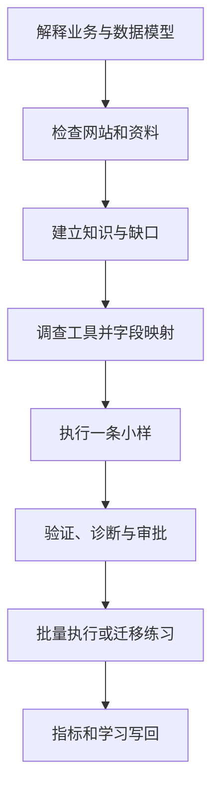

# 建站内容运营 Playbook

## 全流程

## 当前 B2B 内容候选边界

冻结审查规则：任何候选只要任一路出现 FAIL/P0/P1 就永久作废，不得复用其 PASS、Reviewer、签字、digest 或局部绿灯。修复后必须生成下一不可变候选，并由未参与上一候选审查或本轮修复的全新 Reviewer 对同一冻结副本进行只读审查。本文定义目标操作合同，不承载某次候选的即时状态，也不表示任何候选已 ready。

## 阶段 0：解释底层模型

执行前先读 `MENTAL-MODEL.md`。AI 要能向用户说明：

- 业务目标和客户任务；
- 公司、产品、客户语言、内容、图片、发布记录和反馈数据之间的关系；
- 哪些是稳定模型，哪些只是当前工具的操作方式；
- 为什么必须先做单样本、真实页面验证和回滚准备。

如果只能给按钮步骤，不能解释对象、字段和判断标准，不进入后续阶段。

## 阶段 1：进入已绑定的客户任务运行区

先按 [RUNTIME-INTEGRATION.md](RUNTIME-INTEGRATION.md) 使用 `agency-operations` 初始化并激活 `customer-runtime/` 任务。必须由机器真源确认同一 `client_id + company_id + task_id`，再把 [WORKSPACE-TEMPLATE/](WORKSPACE-TEMPLATE/README.md) 中所需内容目录和只读规范投影加载到该任务的受控工作/输出区域。

`WORKSPACE-TEMPLATE/` 不是独立 runtime，不能改名为 `workspace/`，不能替代 ACTIVE-CONTEXT、Registry、CLIENT、TASK 或 HANDOFF。公开包只含 synthetic 空模板；真实客户事实、日志、证据和输出不得进入本包。

## 阶段 2：检查网站和资料

按 `INTAKE.md` 扫描来源，并使用 `TEMPLATES/source-register.md` 建立来源登记和事实表。先读后问，优先复用网站已有信息。

完成闸：

- 关键事实能追溯；
- 冲突和过期信息已列出；
- P0 缺口已回答或明确阻塞；
- 选定一个产品、一篇文章或一张图片作为小样。

## 阶段 3：建立稳定知识对象

使用：

- `TEMPLATES/company-profile.md`
- `TEMPLATES/product-record.md`
- `TEMPLATES/customer-voice-to-content.md`
- `TEMPLATES/article-brief.md`
- `TEMPLATES/image-manifest.md`

内容状态必须保留，不得把推断自动升级为确认。工具变化时，不重写这些稳定对象，只重做接口映射。

## 阶段 4：设计内容

正式买家文章不得只凭主题直接生成。新写文章先读取 [B2B SEO Article Standard](PLAYBOOKS/id-0001-b2b-seo-article-standard.md)；优化现有文章先读取 [B2B Article Optimization SOP](PLAYBOOKS/id-0003-b2b-article-optimization-sop.md)，再按 [B2B Article Stage Patterns](PLAYBOOKS/id-0004-b2b-article-stage-patterns.md) 选择阶段形态；内容质量、事实状态、CTA 和 fatal checks 始终以 ID-0001 为准。随后复制 [Article Brief](TEMPLATES/article-brief.md)，分别绑定 buyer task、search demand 与 SERP format 证据，并记录买家角色、一方证据、unsupported claims、多角色异议、决策工具、风险段和**阶段适配的 CTA**。不得把 Validate 的工程收资模式强制套给 Learn、Troubleshoot、Compare 或 Buy。文章长度不设固定字数，以完整解决买家搜索任务为准；synthetic evidence 只能验证 package contract。

每篇正式文章还必须满足以下 fail-closed 合同：

- Primary SERP 单独结构化记录 exact query、`serp_primary_query_sample_size`、result-type counts、`serp_primary_query_dominant_result_type`、`serp_primary_query_dominant_result_count` 与观察前冻结且 `>0.50` 的 `serp_primary_query_dominance_threshold`。supporting query 只能旁证，不得 pooled 或替代 primary；dominant result type 必须逐层投影为 `expected_content_type`、Draft 可观察 shape、Review/Publish snapshot 与 `serp_content_type_parity_verdict`。
- 正文 canonical 顺序固定为 `Hook → Diagnose → Decide → De-risk → Act`，转化面固定枚举为 `primary|soft|fallback`；Brief、Draft、Review、Publish 必须 exact projection 两张 map 及对应 verdict，不得调序、漏段或把最终 CTA 当成全文唯一 CTA。
- CTA inventory 不依赖 H2 或 `CTA` 标签。首个 H2 前、普通段落、列表、表格、粗体标签、链接、按钮，以及所有 send/email/share/submit/upload/contact/request/book/download/use-form/route-packet 等 buyer-visible 指令均在 scope。末尾安全 CTA 不能覆盖任何更早的 unsafe CTA。
- 已验证 CTA 或 fallback route 必须有 endpoint-specific structured evidence，至少含 `evidence_kind/check_id/task/owner/process/observed_result/capability_acceptance/evidence_ref`，不能靠重复 endpoint 文本自证。未验证 route 全文不得直接链接或指示使用/发送；只允许明确 **do not send、save locally、request a verified route through the buyer organization’s existing approved supplier-contact process**。
- Brief/Draft/Review/Publish 必须 exact projection 主 CTA 的 `cta_destination`、`cta_owner`、reference/reachability/capability 三轴 status/result/verdict/evidence refs、`cta_fallback_route_contract`，以及 `frontend_deferred_blocks=[]`（平台边界项按 ⛔ 禁令不展开）。任一 applicable fatal verdict 为 `block`，必须同时得到 `fatal_gate_verdict: block`、`overall_verdict: block`、`production_readiness: block`；不得自报 ready。
- 内容层先采用 320px 可纵向阅读的表格/决策结构。没有真实 renderer/readability structured evidence 时，移动验收只能记录 `not-run + missing + block`；唯一 evidence schema 为 `evidence_kind=mobile-readability`、`check_id=mobile-readability`、`target_task`、`accountable_owner`、`viewport_width_px=320`、`render_target`、`method`、`observed_result`、`acceptance_criteria`、`capability_acceptance`、`screenshot_or_trace_ref`，禁止 `mobile-visual` 与 `viewport_width` alias；结构 scope 可继续审查，但 production readiness 必须 BLOCK。H1 属于 page-shell metadata；publishable body 禁止 H1，并从 H2 开始。
- 平台前端边界项（⛔ 禁令范围，不展开）本轮保持 deferred/not PASS，但不阻断本轮内容合同 scope；source/license、final DOM alt、CMS、release、排名、询盘和转化仍是独立 BLOCK 或未验证状态。

### B2B article fail-closed contract 路由

执行阶段 4 时必须读取 `RUNTIME-CONTRACT.json#b2b_article_fail_closed_projection` 的全部 `required_gate_ids`，并在 [QA Checklist](QA-CHECKLIST.md#b2b-article-fail-closed-contract-qa) 逐项给出证据。canonical 内容语义仍只由 ID-0001/ID-0003 定义；本 Playbook 只负责把任务路由到以下 gate 组，不建立第二套字段真源：

- 搜索与正文：exact-singleton content family、有序六槽痛点链、buyer-task anchor；
- 转化与事实：开放类 CTA transmission route safety、product claim ledger 证据/适用边界/target parity、unsupported outcome 同义与混淆风险；
- production evidence：stable producer/reviewer IDs、artifact digest 字节绑定、kind-specific 非空且新鲜的 snapshot provenance；
- 证据边界：fixture 或 production-shaped test data 只能证明测试结构，不能证明真实 production、身份、排名、询盘、转化或发布资格。

任一 required gate 缺失、不可执行、未被 Review/Publish 消费或证据不闭合，均维持 `block`。这项路由落档不表示当前模板、示例或 scripts 已通过；平台前端边界项（⛔ 禁令范围，不展开）继续 deferred 且不计为 PASS。

文章和产品页不从关键词开始堆字，而从客户任务开始：

- 客户是谁；
- 他正在解决什么问题；
- 他会如何描述问题和搜索；
- 当前处于了解、比较、验证还是采购阶段；
- 哪些公司和产品事实能真正回答；
- 哪些证据支持；
- 下一步 CTA 是什么。

聊天、询盘和销售异议可以形成搜索意图假设，但必须与站内搜索、Search Console、关键词工具、销售反馈或页面数据交叉验证。

## 阶段 5：调查工具并建立 adapter

不要先找按钮。先完成：

1. 工具解决什么业务问题；
2. 核心对象、字段和状态；
3. 支持 GUI、API、CSV、CLI、MCP、浏览器操作中的哪些接口；
4. 认证、权限、速率、批量、幂等和回滚限制；
5. 使用 `TEMPLATES/tool-field-map.md` 完成“本子库稳定字段 → 平台字段 / 操作”的映射；
6. 单样本的输入、预期输出、成功证据和失败处理。

工具特有内容使用 `ADAPTERS/_template.md` 写进 `ADAPTERS/`，稳定规则不写成某个平台的按钮教程。

## 阶段 6：参考实现——图片

1. 根据 `TEMPLATES/image-manifest.md` 确认图片身份、来源、使用权、产品归属和用途；
2. 统一文件名、尺寸、格式和 alt；
3. 先用 [图片上传统一路由](ADAPTERS/image-upload-routing.md) 判断目标是 AllinCMS 媒体库还是外部图床；
4. 目标为 AllinCMS 时，运行环境预检并调用 `uploadAllinCmsMediaSerial()`；不先配置 PicGo；
5. 每张完成接口上传、自动刷新、media ID / URL / 匿名访问 / 解码验证和原子索引后，才进入下一张；
6. 上传报错先延迟并只读对账；确认远端不存在才有限重试当前图片，对账不明确、索引失败、锁冲突或接口漂移立即停止；
7. 只有需要 CMS 解耦 URL、跨系统复用、迁移练习或用户明确指定时，才使用 PicGo + R2 / GitHub / COS / OSS。

AllinCMS 是当前首个图片参考实现；PicGo 与外部图床是独立备选和迁移练习。换工具时重复“调查 → 映射 → 单图 → 验证”，不降低同一验收标准。

## 阶段 7：参考实现——CMS

先用 [Article Draft](TEMPLATES/article-draft.md) 固定 page-shell title/H1 metadata、唯一 publishable body 与 Adapter 格式合同；正文禁止 H1，并从 H2 开始。草稿进入 CMS 前，再用 [Article Quality Review](TEMPLATES/article-quality-review.md) 独立审查。总分不得覆盖任何 fatal verdict；所有 verdict 只允许 `pass|block|not-applicable`；`article_decision_sequence_verdict`、`conversion_surface_map_verdict`、`hierarchy_scan_verdict`、`semantic_emphasis_verdict` 均属 fatal set，任一 applicable `block` 必须传播为 `overall_verdict=block`、`fatal_gate_verdict=block`、`production_readiness=block`。平台前端边界项（⛔ 禁令范围，不展开）可在本轮内容合同中保持 deferred，但不得写成 PASS，也不得由内容结构 PASS 推导 CMS、release 或 production SEO ready。

1. 读取 `ADAPTERS/README.md` 并调查当前 CMS；
2. 建立产品或文章的对象、字段和状态映射；
3. 选择最安全接口，先上传一个产品或一篇文章为草稿；
4. 检查标题、slug、分类、正文、图片、alt、SEO 字段、CTA 和内部链接；
5. 人工确认后再批量；
6. 覆盖、删除、正式发布和全局设置变更必须单独审批；
7. 每次执行写入 `TEMPLATES/publish-record.md`。

## 阶段 8：真实结果验收与失败诊断

正式文章按 `mutation response → backend refresh → editor reopen → anonymous frontend → desktop/mobile → SEO source → sitemap` 严格验收，并写入 [Publish Record](TEMPLATES/publish-record.md)。API/Server Action 成功只能证明请求层，不能替代后续任一步。

发布后至少检查：

- 真实 URL 返回正常；
- 后台状态与前台页面一致；
- 页面在桌面和移动宽度可读；移动端必须有真实 320px renderer/readability structured evidence，没有运行只能记录 `not-run + missing + block`，不能填写 PASS；
- 图片、标题、正文、表格、FAQ、CTA 和内部链接正常；
- 没有占位符、虚拟示例或未经确认的声明；
- 旧页面未被意外覆盖；
- 失败使用 `TEMPLATES/failure-diagnosis.md` 定位到输入、知识、映射、接口、权限、平台、网络、验证或业务结果哪一层；
- 回滚或补救路径已记录。

## 阶段 9：迁移练习

参考实现跑通后，选择另一图床或 CMS：

- 让 AI 从零调查，不复制旧按钮步骤；
- 建立新字段与状态映射；
- 运行一个独立样本；
- 以真实页面和日志验收；
- 把差异写进新 adapter；
- 用 `TEMPLATES/transfer-exercise-record.md` 保存迁移证据，再用 `QA-CHECKLIST.md` 完成能力验收。

## 阶段 10：写回与复用

按 `WRITEBACK.md` 分流：公司事实与任务数据留在客户运行区；通用模型、模板、adapter 和失败诊断改进经审核后再进入私有母库。
