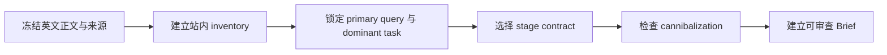

# B2B Article Optimization SOP

## 适用与边界

本 SOP 只适用于 `target_content_language: en`。`target_market` 单独记录；非英文内容 fail closed，转人工语言审查，不得借用英文 validator 结论。

本 SOP 只定义串行优化顺序，不授权 CMS 写入、发布、删除、跨站或远端变更。执行结果只代表内容结构候选；不证明排名、询盘量、询盘质量或转化率提升。

冻结审查规则：失败候选永久作废，不得复用其 PASS、Reviewer、digest 或局部结论。修复后只能生成下一不可变候选，并由未参与上一候选审查或本轮修复的全新 Reviewer 审查同一冻结副本；本 SOP 不承载某次候选的即时状态，也不表示任何候选已经 PASS。

事实状态、字段 grammar、评分和 fatal gates 以 [B2B SEO Article Standard](id-0001-b2b-seo-article-standard.md) 为唯一质量真源。
五阶段的最小正文、产品内链与 CTA 模式见 [B2B Article Stage Patterns](id-0004-b2b-article-stage-patterns.md)；它只解释如何消费 Standard，不新增 alias 或第二套门禁。

本 SOP、四份 canonical template、examples 与 validator 必须在同一候选中投影 Standard 的 canonical 字段与枚举，包括独立 buyer-task/query/search-demand/SERP 证据轴、stage-specific intake、六槽 Direct Answer、六槽位 pain chain、publishable-body boundary 与 qualification contracts；不得生成同义 alias、旧 action 型 commitment 或 snapshot 分叉。本 SOP 不宣称这些对象当前已同步。

四记录的不可分叉 projection 还必须包含：`content_action`、`dominant_search_intent`、`content_family_matches`、`content_family_singleton_verdict`、`customer_language_gate_verdict`、`pain_evidence_gate_verdict`、`evidence_origin`、`fixture_identity`、`production_proof_eligible`、`cta_transmission_action_inventory`、`cta_collection_route_policy_contracts`、`section_information_gain_verdict` 与 `normalized_field_set_redundancy_verdict`。字段缺失、snapshot alias、值漂移或任一记录未消费均 BLOCK。三个 deferred frontend SEO 项 `html-lang|canonical|article-json-ld` 继续保持独立 BLOCK，不因本文整改而变成 PASS。

## Phase A：判断页面是否应存在



### Step 1：冻结输入和语言范围

记录：

- 当前 URL 或草稿路径；
- 标题、正文、来源与产品事实；
- 当前内链、CTA 和 owner；
- `supported_content_languages: [en]`；
- `target_content_language: en`；
- 独立的 `target_market`；
- unsupported claims register。

非英文正文或混合语言无法可靠拆分时立即 BLOCK，等待人工语言审查。

### Step 2：建立 content inventory

列出 hub、产品/solution 页、相邻文章、support/diagnostic 页、comparison 页、RFQ/联系页和计划内容，并标注各自承担的 task。填写：

```text
owner_page
content_inventory_status
inventory_snapshot_ref
inventory_checked_at
cannibalization_status
conflict_candidates
intent_separation
inventory_zero_result_evidence_refs
content_action
```

`content_action` 必须从 `create|update|merge|redirect|do-not-write` 中选择，并从 Brief exact projection 到 Draft、Review、Publish Record；synthetic 新建示例使用 `create`。同时 exact projection `content_family_matches` 与 `content_family_singleton_verdict`，并从 marker 内正文独立重算 exact singleton。fixture 身份只由 `evidence_origin`、`fixture_identity` 与 `production_proof_eligible` 表达。

分支规则：`clear` 可以有 0 candidate，但必须有独立 snapshot 与 zero-result evidence；`resolved` 必须 candidate/separation 按 URL 一一对应；`unresolved` 立即 BLOCK；不得为过闸编造 candidate。

`clear` 的每个 ref 必须精确指向包含 canonical zero-result record 的 fragment，而不是同文件任意关键词、information-gain 或 SERP-gap 段落。记录至少包含：

```text
scope | checked_at | retrieval dimensions | candidate_count=0 | conflict_candidates=[] | intent_separation=[] | observed no matching owner/candidate | snapshot ref | sha256 digest | production-or-synthetic boundary
```

人工 Reviewer 必须复核 fragment、scope、日期、检索维度、唯一 0 结果、空 candidates、observed result 与 snapshot/digest 是否属于同一 inventory。Synthetic placeholder 只能 structure pass；production cannibalization gate 继续 BLOCK。

### Step 3：锁定 query contract，并把 buyer task 与 query evidence 分轴

不再填写 `primary_query_cluster`。依次确定：

```text
primary_query
supporting_query_variants
secondary_intent_contracts = ["supporting-query|buyer-task|stage|commercial-commitment|owner-page-or-this-article|supports-or-delegated"]
excluded_query_modifiers
intent_class = informational|troubleshooting|commercial-investigation|mixed-commercial|transactional
stage = learn|troubleshoot|compare|validate|buy
expected_content_type
buyer_task_evidence_status + buyer_task_evidence_refs + buyer_task_evidence_gate_verdict
query_evidence_status + query_evidence_refs + query_evidence_gate_verdict
search_demand_evidence_status + search_demand_evidence_refs + search_demand_evidence_gate_verdict
search_demand_evidence_schema = exact query set|source/platform|market|language|device|observation_start_at|observation_end_at|metric type|observed value per query|brand/non-brand boundary|zero/low-demand decision|seasonality/trend note|analyst conclusion|independent reviewer|snapshot ref|digest
serp_format_evidence_status + serp_format_evidence_refs + serp_format_evidence_gate_verdict
serp_primary_query
serp_primary_query_sample_size
serp_primary_query_result_type_counts = ["result-type|count"]
serp_primary_query_dominant_result_type
serp_primary_query_dominant_result_count
serp_primary_query_dominance_threshold
serp_primary_query_dominance_verdict
serp_supporting_query_result_type_rows
buyer_language_seeds
query_language_transformation_reason
```

`buyer_language_seeds` 必须有来源，并逐项说明哪些买家原话被保留、哪些被规范化；`query_language_transformation_reason` 必须解释该转换与 primary query、Title/H1 和 opening 的语义一致性。Buyer-task evidence 证明真实买家任务；query evidence 证明真实搜索触发。CRM/访谈/support 可支持前者，但不能替代后者。

先单独观察 primary query，至少记录 5 个 eligible organic results，按 supported result-type family 计数，并在观察/编码前冻结严格大于 0.50 的 dominance threshold。`serp_primary_query_dominant_result_count` 必须达到 `ceil(serp_primary_query_sample_size × threshold)`；并列第一、样本不足、计数不闭合或 threshold 事后调整立即 BLOCK。supporting query 逐条记录自己的 sample/result-type/count/threshold/verdict，只能帮助理解边界，不能 pooled 汇总后替代 primary query 的 dominant result type。

Production query evidence 必须 dated，并按以下唯一 header 逐 exact query 写一行：

```text
query|action|object|observable-output|stage|commercial-commitment|market|language|device|checked_at|evidence_ref
```

执行机械集合检查：

- query rows 的 exact query set 必须等于 `{primary_query} ∪ supporting_query_variants`；`row_count = 1 + supporting_query_variants.length`，每个 query 恰好一行；
- primary query 与每个 supporting variant 都有独立 dated row，generic query-family paragraph 或一个代表性 SERP ref 不能覆盖多个 variants；
- 全部 rows 使用同一 target market/language/device；
- action/object/observable-output 逐槽等于 `dominant_task_contract` 前三槽，stage/commercial-commitment 等于 canonical article fields 与 dominant-task 后两槽；
- 每行 evidence_ref 精确指向包含该 row 的 fragment，`query_evidence_refs` 覆盖全部 row fragments。

以下任一反例直接 BLOCK：缺 action/object/output；漏掉任一 supporting variant；`secondary_intent_contracts` 未与 supporting variants 一一对应；secondary task 扩张 stage/commitment/owner；variant 的 stage/commitment 漂移；仅凭 token overlap 判断同任务。逐条人工确认 semantic parity。`buy / price / quote / supplier / MOQ / lead time / purchase / RFQ` 等 transactional modifiers 默认进入 `transactional` 或 `mixed-commercial` route；若排除，必须有可核验理由、dated evidence、owner page/task 和 target acceptance。Definition、troubleshooting、validation 等其他跨阶段 modifier同样必须排除或委派。

Search-demand fragment 必须逐字段验证 exact query set、source/platform、market、language、device、`observation_start_at`、`observation_end_at`、metric type、每 query observed value、brand/non-brand boundary、zero/low-demand decision、seasonality/trend note、analyst conclusion、独立 reviewer、snapshot 与 digest；`observation_end_at` 不得晚于 evidence `observed_at`、snapshot `captured_at` 或 record `reviewed_at`。Opinion、SERP presence、wrong market/query、无 metric/value、未界定或陈旧 window、漏 seasonality，或把 zero/low demand 主观写成 confirmed，均令 status 保持 `missing|inferred` 且 gate BLOCK。任一 production query/search-demand/SERP axis 未 confirmed 时 fail closed。

再把 SERP-format fragment 的 exact primary query、market、language、shared device、checked_at、primary sample size、result-type family counts、dominant result type/count/predeclared threshold/verdict，以及逐 supporting query rows 结构化绑定，并由 `serp_format_evidence_refs` fragment-bound 引用。四记录 exact projection `serp_primary_query`、`serp_primary_query_sample_size`、`serp_primary_query_result_type_counts`、`serp_primary_query_dominant_result_type`、`serp_primary_query_dominant_result_count`、`serp_primary_query_dominance_threshold`；counts 必须使用 `result-type|count` 数组、总和等于 sample size，并可独立重算 dominant type/count；未运行或 synthetic 无真实 SERP 时统一使用 `[]` 与 `not-run`；`serp_primary_query` 必须逐字符等于 `primary_query`。执行 content-type fatal closure：

```text
Primary-query sample size + dominant result type/count/predeclared threshold/verdict
→ Brief/Draft exact SERP projection + expected_content_type exact parity
→ Draft observable structure
→ Review expected_content_type_snapshot + Production serp_content_type_parity_verdict
→ Review independent body_content_family_implementation_verdict from marker-visible structure
→ Publish exact dominant-result projection + snapshot + both verdicts
```

按主导 result type 检查对应正文结构：checklist 要有可操作项或表格；comparison/matrix 要有共同维度；calculator 要有输入、公式/规则与输出；diagnostic/troubleshooting 要有症状、分支与 stop；guide/how-to 要有有序步骤；case study 要有问题、做法和有来源结果；product/category/landing 要完成对应商业任务。任何无法映射、字段漂移、正文未实现、snapshot 不一致或 verdict=`block` 都立即 BLOCK。Synthetic fixture 只能证明结构，不得冒充 Production SERP evidence。

### Step 4：锁定 dominant buyer task、唯一枚举与 applicability

按五段 grammar 写：

```yaml
stage: "learn|troubleshoot|compare|validate|buy"
intent_class: "informational|troubleshooting|commercial-investigation|mixed-commercial|transactional"
commercial_commitment: "none|soft|commercial"
dominant_task_contract: "action | object | observable output | stage | commercial commitment"
cta_interaction_type: "inline-no-input|local-tool|input-collecting|human-handoff|commercial"
stage_intake_contract: "none|troubleshoot-support|compare-handoff|validate-technical|buy-commercial"
cta_input_collection_applicability: "applicable|not-applicable"
cta_input_collection_not_applicable_reason: "required when not-applicable"
stage_link_requirement_status: "applicable|not-applicable"
stage_link_not_applicable_reason: "required when not-applicable"
```

`dominant_search_intent` 必须先写成一个具体买家意图，并与 `primary_query`、`dominant_task_contract`、`stage`、`commercial_commitment` 一起四记录 exact projection。`secondary_intent_contracts` 每行六槽：query、buyer task、stage、commitment、owner、relation；stage 必须等于 canonical stage，commitment 必须从 `none|soft|commercial` 取值并等于 canonical commitment；`supports` 的 owner 只能是 `this-article`，`delegated` 的 owner 必须是不同的非 `this-article` owner page。supporting query/task 只能支持 dominant task，不能汇总替换 dominant intent；非 Buy 不得扩张到 quote/RFQ/order/supplier award 等 terminal commercial action。

执行五阶段 intake 矩阵：

| Stage | Intent / commitment | CTA default | `stage_intake_contract` | Intake / qualification boundary |
|---|---|---|---|---|
| Learn | informational / `none` | inline-no-input | `none` | 默认不收资、无 qualification |
| Troubleshoot | troubleshooting / `none` | local-tool；support 时 human-handoff | 本地闭环 `none`；support 才 `troubleshoot-support` | 只收当前诊断/support 所需输入，不启用两轮 technical profiling |
| Compare | commercial-investigation / `none` | local-tool/inline-no-input | 默认 `none`；证据化 mixed-commercial handoff 才 `compare-handoff` | 只收最小 handoff 字段，不启动 technical-qualified lifecycle |
| Validate | commercial-investigation / `none` | human-handoff/input-collecting | `validate-technical` | 唯一允许两轮 technical progressive refinement；最多 technical-qualified |
| Buy | transactional 或 mixed-commercial / `commercial` | commercial | `buy-commercial` | 独立 RFQ/commercial packet；named commercial owner；不继承 Validate intake 或 technical-qualified lifecycle |

严格映射：`none` 对应 input not-applicable；`troubleshoot-support` 只用于 Troubleshoot；`compare-handoff` 只用于有 dated evidence 的 mixed-commercial Compare；`validate-technical` 只用于 Validate；`buy-commercial` 只用于 Buy。Applicable 不再自动等于 progressive profiling 或 technical qualification。Stage/intake/applicability/owner/state 任一不一致即 BLOCK。

跨角色 CTA 还要分开记录：`cta_receiving_owner` 是买方侧接收任务的 named owner，必须与 `cta_to_role` 一致；`cta_owner` 是外部 destination 对输出负责的 named owner。Buy commercial route 不得把两者混成一个 owner，也不得复用仅面向 engineering/technical readiness 的 destination。

Internal-link role 只允许 `hub|product|solution|educational|comparison|diagnostic|support|technical-review|conversion|commercial`，旧 `diagnosis` alias 禁止进入机器字段。五阶段矩阵：Learn=`educational,hub`；Troubleshoot=`diagnostic,support`，按诊断结果才允许 `technical-review,product`；Compare=`comparison`，有证据化候选才允许 `product,solution,hub`；Validate=`technical-review`，candidate 非 stop 才允许真实 `product,solution,hub`；Buy=`product|solution` 加按真实下一任务选择的 `conversion|commercial`。 `stage_link_requirement_status=applicable` 时，正文无 buyer-visible link 或 link 被 withheld 必须 `buyer_visible_internal_links_verdict=block`，不能写 `not-applicable`。Negative fixture 保留该 block；positive fixture 必须在正文真实出现 task-led Markdown link并通过 reference/reachability/capability/target acceptance 全 gate。Synthetic placeholder 只能证明结构，不能成为 Production proof。

Canonical template vocabulary 必须逐字符使用上表枚举。明确拒绝 `commercial_commitment: none-or-commercial`、`cta_interaction_type: self-serve-or-human-handoff`、任何遗漏 `mixed-commercial` 的 intent vocabulary，以及 action 型 commitment；不得用 alias mapping 静默转换。

Applicable 的 input-collecting、human-handoff 与 commercial CTA 必须把 copyable fallback 真正写进买家可见 CTA 区，并按 evidence axis 严格二选一：

- **verified route 分支**：给出具体 buyer-visible email、portal、form 或 endpoint、external route owner 与原 commitment boundary；只有 destination、reference、reachability、capability、policy contract、retention、deletion path 与 named retention owner 均为该 endpoint 自己的 confirmed evidence，才允许 supplier-side collection 或发送；
- **unverified / unconfigured 分支**：明确说明没有已完成 route+policy verification，不要发送 packet、把 packet 保存在本地，并通过买家既有且已批准的 supplier-contact process 请求 **verified route plus data-policy details**；各 gate 保持 `not-run/missing/block`，不得把 `verified/approved/secure channel` 写成既成事实。

frontmatter 中有模板但正文不可见，或买家文案强于证据状态，均即 BLOCK。

只有 applicable 分支要求 inputs、destination、qualification 或 link target/evidence；not-applicable 分支理由必填且不得伪造对象。`technical-review`、sample/RFQ/supplier-selection 等是 action/CTA/output/link role，不是 commitment。Validate 可以完成 technical qualification，但 Validate task 内 sales acceptance 必须 not-applicable；显式商业意图另行路由到 Buy/commercial task，Validate 不产生 sales acceptance、RFQ、order 或 supplier-award commitment。Compare 只有 dated query/SERP/first-party evidence 支持时才可 `mixed-commercial/soft`。

### Step 5：建立六节点因果链

从可追溯客户、支持、销售或产品证据提取 canonical contract：

```yaml
pain_chain_contract: "actor | operating-event | evidence-gap | rework-mechanism | program-consequence | bounded-decision"
```

`actor` 是第一个且不可省略的因果槽位；六槽位固定为 actor → operating-event → evidence-gap → rework-mechanism → program-consequence → bounded-decision，不得再称为五节点。Buyer-visible 正文必须依次公开且只出现一次 `1. **Actor:**`、`2. **Trigger:**`、`3. **Evidence gap:**`、`4. **Rework:**`、`5. **Consequence:**`、`6. **Decision:**`；标签后的内容必须使用自然、专业的行业语言，Reviewer 逐槽检查具体对象、证据缺口、返工机制、有边界后果和本文可完成决定。Pain/因果仅为 inferred 或 synthetic 时，买家正文只能使用 `may / can / risks` 等有边界措辞；确定性 `creates / causes / will`、供应商行为、成本或客户原话无证据即 BLOCK。Review 只写并消费 `six_node_causal_chain_verdict`；`five_node_causal_chain_verdict` 出现即 BLOCK。

## Phase B：建立可区别的决策内容


### Step 5A：锁定 evidence origin、customer language 与 pain gate

四记录 exact projection：`evidence_origin=synthetic-fixture|test-fixture|live-production`、具体 `fixture_identity|not-applicable` 与 `production_proof_eligible=true|false`。Synthetic/test fixture 必须 `production_proof_eligible=false`；Production 必须 `live-production + fixture_identity=not-applicable + true`。Production 还必须同时满足 `customer_language_status=confirmed`、非空 `customer_language_refs`、`customer_language_gate_verdict=pass`，以及 `pain_evidence_status=confirmed`、非空 `pain_evidence_refs`、`pain_evidence_gate_verdict=pass`。任何 inferred、空 refs、fixture evidence 或 gate block 都不得进入 Production readiness。

### Step 6：分开记录 task/query evidence、gap 与 information gain

分别记录并独立过闸：

- Buyer-task evidence：真实买家是否有该 operating task；
- Query evidence：真实 query 是否触发该 action/object/output/stage/commitment；
- Search-demand evidence 与 SERP-format evidence；
- SERP-format structured evidence 必须放在独立、fragment-bound evidence fragment 的正文中，包含 flat `query_set`, `market`, `language`, `device`, `checked_at`, `result_types`；四记录 frontmatter 不得使用 nested mapping，只通过 `serp_format_evidence_refs` 绑定。Production 中 `query_set == [primary_query, ...supporting_query_variants]`，market/language 等于目标字段，device 等于全部 11-slot query rows 的唯一 shared device，result types 非空，并由同一 dated immutable snapshot/digest 支持；
- Information-gain artifact：本文实际新增什么决策工具/方法；
- Market information gain：相对当前真实 SERP/市场内容是否有差异。

Production query evidence 必须 dated 并使用 query row grammar；search demand 必须使用独立 production schema，并按 exact query 给出可复核 metric/value、zero/low decision、seasonality/trend、analyst 与 independent reviewer，不能以 opinion 或 SERP presence 冒充 confirmed。Query/search-demand/SERP 任一 status 未 confirmed 时 production gate 为 BLOCK。`BLOCK` 只写 gate verdict，不能写 status。

Production information gain 两轴 confirmed 时，artifact refs 与 market refs 都必须非空、指向不同且准确的 fragments；artifact fragment 证明真实 decision artifact，market fragment 包含 dated market/SERP comparison（market、language、query set、checked_at、corpus/snapshot、差异维度、reviewer）。同一泛化段落、错锚或 undated comparison 立即 BLOCK。

Synthetic fixture 只能验证 artifact shape：query/search-demand/SERP-format 和 market status 保持 missing，对应 production gate BLOCK；`production_evidence_score` 只写 `not-applicable`。

在 Brief、Draft、Review、Publish Record exact projection `in_scope_questions`、`out_of_scope_questions` 与 `intent_completion_test`；同一或同义问题同时进入 in/out scope、completion test 落到另一个 owner/stage，或 Validate 文章以 quote/RFQ/order/supplier award 为完成条件时立即 BLOCK。

### Step 6A：条件性决定 FAQ，而不是默认添加

在 query contract、SERP gap、buyer objection 与 information gain 证据已分轴后，再决定 FAQ 是否存在：

唯一 trigger enum 为 `dated-serp-pattern|documented-buyer-objection|documented-buyer-uncertainty|none`。Applicable FAQ 每行必须严格使用 `question|buyer_job|objection_or_uncertainty|evidence_ref_or_explicit_inferred_boundary|article_owned_answer`；四记录逐字符一致，旧 trigger、两槽 FAQ row 或 alias 一律 BLOCK。

1. 查找 dated 的真实 SERP/query pattern：只接受同一 dominant buyer task 下、正文决策路径尚未自然承接的具体追问；
2. 查找 buyer-task、CRM、访谈、support、sales 或产品研究中的具体 objection / uncertainty；
3. 若两类触发都不存在，记录 `faq_applicability=not-applicable`、空 evidence refs 与具体 absence reason，然后继续，不补 FAQ、不扣分；
4. 若触发成立，记录 `faq_applicability=applicable`、唯一 trigger type 和 evidence refs，并逐题填写：

```text
question | buyer_job | objection_or_uncertainty | evidence_ref_or_explicit_inferred_boundary | article_owned_answer
```

逐题清理：

- buyer job 与 dominant task 或有证据的 secondary buyer task 不一致：删除或委派到 owner page；
- 只是正文标题/段落的改写：合并回正文，不保留 FAQ；
- 只是同义关键词或长尾词排列：删除；
- 只能推断：明确标为 `inferred`，写出依据和不可外推边界，不得升级 production evidence；
- 答案不由本页拥有：按 internal-link / CTA delegation 合同路由，不假装已回答；
- 唯一理由是“SEO 最佳实践”或希望增加字数：不得添加。

FAQ 是条件组件；没有触发证据的 absence 是合格结果。不得以 FAQ 数量、关键词覆盖率或“每篇必备”清单替代搜索意图完成度。

### Step 7：建立 buyer-role scope 与 delegation

Primary role 必填并控制叙事。Secondary roles 仅在有 evidence ref 时加入，使用：

```text
role | evidence_ref | concrete objection | article-owned answer
```

Engineer、Quality、Procurement、Management 仅作为 Reviewer lenses，不再要求正文全部出现。

跨角色 delegation 使用唯一 grammar：

```text
from_role|to_role|url|retained_task|receiving_task|owner|acceptance_evidence_ref
```

`role_handoff_contracts` 与 CTA input collection 解耦：CTA 或 stage link 任一把任务交给另一角色时都必须写 handoff；`cta_input_collection_applicability` 只控制 inputs/destination/qualification collection，`stage_link_requirement_status` 只控制 link target/owner/acceptance。合法例：Learn 使用 `inline-no-input`、不收资，但 applicable educational link 把后续任务交给另一角色；Compare 使用 `local-tool`、不收资，但 applicable comparison link 形成跨角色委派——两者都必须有 handoff row。若 CTA 与 stage link 均无跨角色 target，`role_handoff_contracts` 必须为空，伪造 handoff 为 BLOCK。

四记录必须 exact parity 投影 `cta_from_role`、`cta_to_role`、`cta_receiving_task`、`cta_receiving_owner`。`human-handoff` 或 `commercial` CTA 跨角色时，必须恰好匹配一条 handoff row：`from_role == cta_from_role`、`to_role == cta_to_role`、`url == cta_destination`、`receiving_task == cta_receiving_task`、第六段 `receiving_owner == cta_receiving_owner`。`cta_owner` 单独表示 external route 对输出负责的 accountable owner，不得拿它替代 buyer-side receiving owner。CTA 非跨角色时四个字段全部为精确 sentinel `not-applicable`，且不为 CTA 编造 handoff；真实 stage-link handoff 仍独立记录。

目标页未接受 receiving task 时，不得把问题推出本文。人工 Reviewer 必须核对七段是否绑定同一 handoff；目标 owner 必须是稳定 owner ID 或 `person name + role`，不能只是部门、团队或岗位。主题相关或 URL 存在不等于 target acceptance。

`secondary_buyer_role_contracts` 唯一 grammar 为 `role|evidence_ref|concrete_objection|article_owned_answer`：每个 `secondary_buyer_roles` 恰好一行，不重、不漏、不多；空 roles 对应空 contracts。Production evidence 必须 dated、fragment-bound、non-synthetic。`buyer_role_matrix` 已 retired/forbidden，不得作为兼容输入或第二真源。

### Step 7A：冻结首轮输出、candidate decision gates 与终点动作

在四记录中逐字符投影以下字段，不得使用 snapshot alias：

```yaml
terminal_action_contract: "action|object|observable-output|stage|commercial-commitment"
first_round_expected_output: "packet-completeness|missing-evidence-list|next-review-step|not-applicable"
candidate_decision_required_gates: ["complete-second-round-package|not-applicable", "named-technical-owner-review|not-applicable"]
first_round_output_candidate_gate_verdict: "pass|block|not-applicable"
```

- `validate-technical` 第一轮只返回 packet completeness、missing-evidence list 与 next review step。任何 `candidate-or-stop`、candidate approval、technical-qualified 或 supplier-selection 等价结论都必须等待完整第二轮 package 与 named technical-owner review；两门任一缺失即 BLOCK。
- 非 `validate-technical` 分支将首轮输出与 candidate gates 明确设为 `not-applicable`，不得借用 Validate 两轮 lifecycle。
- `terminal_action_contract` 只写文章当前页面内可完成的最后动作，并与 dominant task、Act row、stage、commitment exact parity。请求 verified route 属于独立 fallback/delegated recovery，只能写入 fallback contract 与 CTA inventory，不能改写 terminal action。
- route/reference/reachability/capability/data-policy/retention/deletion/owner acceptance 任一 BLOCK 时，buyer-visible copy 只能要求本地保存 packet 并请求 verified route/policy details；不得出现 submit/send/email/upload/share/transmit/proceed 等传递指令或可点击 endpoint。

### Step 8：建立九段 product decision map

按顺序写入 Brief、Draft 和可见正文：

```yaml
product_decision_map:
  - "condition | variable | evidence | no-fit | remaining inputs | candidate-or-stop | candidate target | next-validation target | placement"
```

Candidate 非 stop 时必须对应真实 product、solution 或能承接该候选方向的 hub link。Stop 时 candidate target 可 N/A，但 next-validation target 必须可执行。不得把 brochure、导航页或空比较表当作候选证据。

人工 Reviewer 必须逐段确认 condition→variable→evidence→no-fit→remaining inputs→candidate-or-stop→candidate target→next-validation target→placement 在可见正文中的顺序和语义；字段数量或分隔符通过不能替代此审查。

### Step 9：重写 Direct Answer、Title/H1、首屏和可发布正文

先固定 `article_decision_sequence_map`：`Hook → Diagnose → Decide → De-risk → Act`。五段必须服务同一 dominant task；可合并相邻 section，但不可调序、漏段或把 Act 提前成无证据销售动作。再固定 `conversion_surface_map`：`primary|soft|fallback`，每类记录目标、位置、interaction 和 route ID；不适用必须有非空理由。Review/Publish 分别给出并消费 `article_decision_sequence_verdict` 与 `conversion_surface_map_verdict`。

先填写唯一六槽合同：

```yaml
direct_answer_action: "..."
direct_answer_object: "..."
direct_answer_required_inputs_or_evidence: "..."
direct_answer_condition_or_boundary: "..."
direct_answer_expected_output_or_route: "..."
direct_answer_evidence_boundary: "..."
```

六项共同构成 Direct Answer。正文不必显示固定 `Direct answer:` 标签。首个 H2 前目标约 120–140 个英文词，并同时呈现 fictional disclosure（仅 fixture）、buyer task、narrow ICP fit、explicit exclusion、buyer self-identification、first-round output 与 commitment boundary；不得重复完整 worksheet。Brief、Draft、Review 与可见正文六项语义一致；关键词重合或逐字复制不能代替人工 parity。

再审 Title/H1：

- 与 primary query 的主题/对象语义一致；
- 与 dominant task 的 action/object/observable output 一致；
- 与 stage/intent/commitment 一致；non-Buy 禁 transactional modifier，除非先重分类或有真实 delegation；
- `title_primary_query_parity_verdict`、`title_dominant_task_parity_verdict`、`title_stage_parity_verdict`、`h1_title_task_parity_verdict`、`hierarchy_scan_verdict` 任一为 `block`，`fatal_gate_verdict` 必须为 `block`；
- `H1` 只指 page-shell title metadata；Brief/Draft/Review 审查其与 title/query/task/stage 的 parity。publishable body 无条件禁止 Markdown H1，并从 H2 开始。

Draft 必须有且只有一对唯一边界：

```html
<!-- PUBLISHABLE_BODY_START -->
<!-- buyer-visible body only -->
<!-- PUBLISHABLE_BODY_END -->
```

Marker 外仅保存 control record，禁止直接发布。Marker 内禁止 `# Article Draft`、内部状态码/字段名、schema parity、evidence gate、placeholder、validator/release/renderer note、`replace-with-*`、`[H2: ...]`、编辑指令和任何 H1。只提取 marker 内 body；marker 缺失、重复、倒置、空 body、控制记录泄漏或正文 H1，立即 BLOCK。

正文主要建议按 `Condition → Action → Evidence → Boundary` 展开；H2 对应买家决策路径，H3 对应变量、证据、方法或失败条件。`hierarchy_scan_verdict` 必须被 Review 与 validator 消费，不能生成 BLOCK 后仍 overall PASS。

### Step 10：规划 component intent 与 semantic strong

逐 section 检查 information gain 与 normalized field-set redundancy。完整 first-round field set、units、formats 与 examples 只允许存在于一个 source surface：优先唯一 worksheet；无 worksheet 时才允许唯一 copyable fallback，二者不得同时列全集。Opening 交付痛点/答案/fit/exclusion/边界；decision artifact 使用纵向 H3/definition-like blocks、key-value stack 或最多两列，只解释变量如何改变决定；preparation、final CTA 与 fallback 均引用 worksheet，不重列字段。表格、列表、同义改写和换序仍算重复。`section_information_gain_verdict` 或 `normalized_field_set_redundancy_verdict` 为 block 时立即停止。

Pain-chain 正文必须保留六个固定、编号、加粗且唯一的 buyer-visible label，并与 `semantic_emphasis_plan` 一对一匹配完整 buyer judgment；自然行业化表达写在标签之后，不得隐藏、改名、重排或重复标签。

每个 strong 绑定：

```text
decision-scanning-role | complete judgment | placement
```

允许角色：`condition / risk / evidence / no-fit / boundary / action / decision`。一个泛粗体不能通过 semantic-emphasis gate。不设置固定 H2、粗体、图片、表格、链接或 CTA 数量。

提交 Review 前删除重复句、重复判断、同义低信息段和没有新增 condition/evidence/action/boundary 的组件。首个 H2 前压缩到约 120–140 个英文词；synthetic disclosure 必须在 marker 内首屏出现；作者判断改用普通正文或 strong callout，不用 blockquote。同步填写 `visual_decision_assets` 九槽合同；asset type 只允许 `diagram|decision-tree|decision-table|worksheet|annotated-product|process-flow`。`decision-table|required` 必须在对应 H2 内存在真实 Markdown table，并声明 320px stack fallback。每个 required asset 必须支持 dominant task、具体 claim、证据引用、真实 H2 placement 和移动端可读性，不适用时记录明确阶段理由。

决策表先做内容层小屏重构：优先两列、key-value stack、分组卡片、definition list 或重复表头的纵向结构。4–6 列长文本表格不得仅凭“响应式”声明获得 PASS。没有真实 320px renderer/readability structured evidence 时记录 `mobile_visual_check_execution_status=not-run`、`mobile_visual_evidence_result=missing`、`mobile_visual_gate_verdict=block`、空 refs；结构 scope 可继续审查，但 production readiness 必须保持 `block`。只有 evidence bundle 包含 `evidence_kind=mobile-readability`、`check_id=mobile-readability`、`target_task`、`accountable_owner`、`viewport_width_px=320`、`render_target`、`method`、`observed_result`、`acceptance_criteria`、`capability_acceptance` 与 `screenshot_or_trace_ref`；`mobile-visual` evidence kind 和 `viewport_width` alias 禁止，才可给 evidence-backed pass。

### Step 11：建立 stage-specific internal link map

先写：

```yaml
stage_link_requirement_status: "applicable|not-applicable"
stage_link_not_applicable_reason: "required when not-applicable"
```

`applicable` 时分别记录 `required_when_applicable` 与 `allowed`：Learn 至少一个 `educational|hub`；Troubleshoot 至少一个 `diagnostic|support`，只有诊断后需要进一步处理才允许 `technical-review|product`；Compare 必须有 `comparison`，命名候选时才允许 `product|solution|hub`；Validate 必须有 `technical-review`，candidate 非 stop 时才允许真实 `product|solution|hub`；Buy 至少一个 `product|solution`，并至少一个真实下一任务 `conversion|commercial`。唯一 role 枚举为 `hub|product|solution|educational|comparison|diagnostic|support|technical-review|conversion|commercial`；旧 alias `diagnosis` 禁止。每条 link 同时记录 target、owner、acceptance evidence，跨角色还要 delegation contract，并分轴验证 reference/reachability/capability。

`not-applicable` 只允许当前任务在正文内闭环且无需离页，必须写具体任务理由；此分支不要求 URL、owner 或 link gate，不得为数量门槛添加无用链接。

### Step 12：按 stage intake 建立 CTA、owner、qualification 和 fallback

先扫描唯一 publishable body 的全部 buyer-visible action。扫描范围不能依赖 H2：包括首个 H2 前导语、普通段落、列表、表格、strong 标签、heading、链接/URL、按钮，以及 `submit/send/share/upload/contact/book/download/email/forward/transfer/request/use/route` 和同义指令。每一项写入：

```text
buyer_visible_cta_inventory = surface-id|location-kind|locator|instruction|destination|owner|interaction-type|route-status|evidence-bundle-ref|fallback-contract-ref
```

漏一项即 BLOCK；最终安全 CTA 不能覆盖早期 unsafe instruction。

先锁定 `stage_intake_contract`，再填写该分支允许的 inputs、destination、owner 和 states：

- `none`：不收资、不发 intake fields、不 qualification；
- `troubleshoot-support`：只收复现/环境/症状/已尝试步骤/安全边界等当前 support 必需输入；可 `needs-follow-up`，不使用两轮 technical profiling，不产生 technical-qualified/sales-accepted；
- `compare-handoff`：仅有证据的 mixed-commercial Compare 可用，收最小 handoff 字段，默认无 qualification；
- `validate-technical`：唯一使用两轮 technical progressive refinement；首轮默认 4–6 个最小决策输入，且只输出 completeness、missing evidence 与 next review step；candidate-or-stop 仅在完整第二轮 + named technical-owner review 后；二轮按下列 grammar；
- `buy-commercial`：独立 RFQ/commercial packet，包含 explicit commercial intent、数量/MOQ、市场、时间、交付/贸易条件和必要技术输入，由 named commercial owner 判断；不继承 Validate 的 technical-qualified lifecycle。

Validate canonical field 与 strict row grammar：

```yaml
second_round_input_relationships:
  - "second_round_item|new-or-refines|first_round_item-or-not-applicable|additional_decision_purpose"
```

每个二轮 item 在 `second_round_input_relationships` 中恰好一行；每行严格四槽且不允许额外空格分隔 alias。`new` 的第三槽为 `not-applicable`；`refines` 精确引用首轮 item，并说明 summary→detail 如何改变判断。不得重复索取同一个值、只换措辞或单位，或没有新增 decision purpose。二轮请求与该数组必须集合一致。`cta_second_round_rows`、`second_round_rows` 等旧字段一律 BLOCK，不做 alias mapping。

所有 applicable route 都必须写 trigger、minimum inputs、expected output/route、boundary、真实 destination、named owner、capability evidence、preparation path 和 copyable fallback；并在实际 CTA 段内可见呈现 `cta_value_exchange`、`cta_response_expectation`、`cta_submission_method`、`cta_confidentiality_or_data_boundary`、`cta_commitment_boundary`、`cta_buyer_visible_owner`。同时按 `product_link_evidence_level=none|family-level|sku-level` 审查产品链接证据，不得把 solution family 写成具体 SKU fit；只有 Validate 使用上述二轮技术合同。`terminal_action_contract` 只写本页可完成动作，request verified route 是独立 fallback；route/policy 任一 gate 为 BLOCK 时，禁止 buyer-visible `submit / send / email / upload / share / transmit / proceed` 及同义动作，只允许 local preparation + request verified route/policy details。Qualification row grammar：

```text
state|cause-category|evidence-rule|owner|next-step
```

Cause-first semantics 必须服从 stage/intake：Troubleshoot/Compare 不得被 validator 强制成 Applications Engineering 预审；Validate 的 complete technical evidence + named technical owner acceptance 才可 `technical-qualified`；Buy 的 explicit commercial intent + commercial packet complete + named commercial owner acceptance 才可 `sales-accepted`。Applications Engineering 只能是 technical reviewer/deliverable/follow-up owner。

Named owner 只接受稳定 owner ID，或 `person name + role`；部门、团队、岗位、`AI`、`TBD` 和多个候选 owner 均不合格。每条 reason row owner 必须与当前 route 的 canonical owner 精确相等。

随后枚举唯一可发布正文中的**全部 buyer-visible CTA sections**，不得只审最后一个 CTA；`cta_transmission_action_inventory` 必须覆盖 open-class 的全部 transfer/control actions（含 save、request、send、submit、upload、share、copy into、attach、paste、transmit、hand off control 及语义等价形式），并在 Brief/Draft/Review/Publish 逐字符 exact projection。Brief、Draft、Review、Publish 的 `cta_fallback_route_contract` 必须逐字符一致，并严格使用 17 段 row：

```text
route-status|endpoint|owner|required-inputs-mode|commitment-boundary|reference-execution|reference-result|reference-verdict|reference-refs|reachability-execution|reachability-result|reachability-verdict|reachability-refs|capability-execution|capability-result|capability-verdict|capability-refs
```

- `verified` primary/fallback route 必须绑定该 endpoint 自己的 structured evidence bundle，至少含 `evidence_kind/check_id/task/owner/process/observed_result/capability_acceptance/evidence_ref`；三轴均为 `executed|confirmed|pass` 且 refs 非空。不得借用主 CTA 或其他 endpoint 的证据，也不能靠重复 endpoint 文本、链接、HTTP 200、toast 或作者自述；
- `unverified-unavailable` 必须使用 `endpoint=not-applicable`、三轴 `not-run|missing|block|not-applicable`；全文不得直接链接或指示买家 use/send/email/share/submit/contact 到 primary/fallback endpoint，且每个 buyer-visible CTA 都无条件明确“不要发送、保存本地、经买方既有 approved supplier-contact process 请求 verified route”。任何肯定性 verified/approved/secure/existing route，或只在 form unavailable 时才 no-send 的条件式写法，都 BLOCK；
- execution/result/verdict 分别只允许 `not-run|executed|not-applicable`、`missing|synthetic-only|confirmed|failed|not-applicable`、`pass|block|not-applicable`；
- `cta_receiving_owner`、route owner 与 role-handoff receiving owner 共用 named-owner 规则，纯岗位名同样 BLOCK；
- `soft_path_route_safety_verdict`、`all_buyer_visible_cta_sections_evidence_parity_verdict`、`cross_cta_instruction_consistency_verdict` 任一 `block` 都必须进入 fatal gate；
- Brief/Draft/Review/Publish 的主 CTA `cta_destination`、`cta_owner`、reference/reachability/capability execution-result-verdict-evidence refs 与 17 段 fallback contract 必须逐字符 exact projection；`frontend_deferred_blocks` 必须是四记录完全相等的 exact set `[html-lang, canonical, article-json-ld]`。

所有实际收资的 verified primary/fallback endpoint 还必须各自恰好绑定一行 `cta_collection_route_policy_contracts`：

```text
route-id|endpoint|required-inputs-mode|data-purpose|retention-period|deletion-path|retention-owner|policy-contract-id|policy-version|policy-digest|policy-checked-at|policy-observed-at|policy-reviewed-at|policy-review-ceiling|policy-status|policy-owner-acceptance|policy-evidence-refs|deletion-capability-evidence-refs
```

endpoint 与 route-id 必须逐字符匹配；fallback 不得借 primary 的 policy/deletion evidence；`required-inputs-mode=none` 不触发 policy row。Collecting policy 必须绑定 contract/version/SHA-256 digest、checked/observed/reviewed 时间与 review ceiling，满足 `checked/observed <= reviewed <= ceiling`；过期或缺项即 BLOCK。旧 `cta_data_*` scalar 如保留，只能是 primary collecting row 的 exact projection。后台 Reviewer 核验 retention owner 等完整治理字段；买家只看到用途、data boundary、route availability 与 responder，不承担内部治理调查。

实际结果字段只允许 Buyer 细粒度 closed enum，并使用同一 evidence contract：

```yaml
actual_ranking_status: "unverified|not-applicable|observed-no-improvement|observed-improvement"
actual_inquiry_status: "unverified|not-applicable|observed-no-improvement|observed-improvement"
actual_sales_acceptance_status: "unverified|not-applicable|not-accepted|sales-accepted"
actual_conversion_status: "unverified|not-applicable|observed-no-improvement|observed-improvement"
actual_outcome_observation_window: "dated-window|not-applicable"
actual_outcome_metric_or_event_definition: "metric-or-event-definition|not-applicable"
actual_outcome_observed_result: "bounded-observed-result|not-applicable"
actual_outcome_evidence_refs: []
actual_outcome_accountable_reviewer: "stable-reviewer-id-or-person-name-plus-role|not-applicable"
actual_sales_acceptance_evidence_refs: []
```

Ranking、inquiry 或 conversion 为 `observed-no-improvement`/`observed-improvement`，以及 sales acceptance 为 `not-accepted`/`sales-accepted` 时，必须填写 dated window、metric/event definition、bounded observed result、非空 shared evidence refs 与 accountable reviewer。Improvement 必须由结果证据支持；没有证据时保持 `unverified`，不能写 not-accepted 或 improvement。`sales-accepted` 还要求非空 `actual_sales_acceptance_evidence_refs`，并证明四个 exact gates：`explicit-commercial-intent`、`commercial-qualification-required`、`commercial-inputs-complete`、`named-commercial-owner-reviewed-and-accepted`，以及 named commercial owner 与 commercial next step。

`unverified` 或 `not-applicable` 的 synthetic/production record 必须把四个 shared scalar evidence fields 写为 `not-applicable`，把 `actual_outcome_evidence_refs` 与 `actual_sales_acceptance_evidence_refs` 写为 `[]`。不能把 CTA submit、technical review、technical-qualified、synthetic fixture 或结构 PASS 当结果证据。

Reference、reachability、capability 分别使用 `check_execution_status`、`evidence_result`、`gate_verdict`。Production applicable gate 只有 executed + confirmed + pass 才通过；missing/not-run 不得写 PASS。不得以 endpoint 重复文本、链接存在、HTTP 200 或另一 endpoint 的证据替代 `evidence_kind/check_id/task/owner/process/observed_result/capability_acceptance/evidence_ref`。

## Semantic closure contract（贯穿 Step 3–13）

以下不是“多填几个字段”，而是必须由 Brief → Draft → Review → Publish Record exact projection、由人工 Reviewer 做语义复核、并由 validator fail-closed 的生产合同：

1. **Step 3 / content family exact singleton**：对 `expected_content_type` 和 Production primary-query dominant result type 收集全部 supported family matches：`checklist|comparison|calculator|diagnostic|guide|case-study|product-landing`。必须恰好命中一个 family；0 或多个 match 都 BLOCK，不能 first-match 放行。声明 family、SERP family、正文 observable family、Review/Publish snapshot 必须全等。
2. **Step 4 / terminal action**：四记录写入 `terminal_action_contract = action|object|observable-output|stage|commercial-commitment`，并与 dominant task、`Act` row、stage 和 commitment 同义一致。Learn/Troubleshoot/Compare/Validate 的 terminal action 不得包含 nominate、appoint、award、supplier/manufacturing-partner selection、quote、RFQ、order 或同义商业终点；归一化检查须抵抗大小写、标点、连字符和零宽字符拆词。
3. **Step 5 / ordered pain-chain contract**：控制记录与唯一可发布正文都必须按 `Actor → Trigger → Evidence gap → Rework → Consequence → Decision` 固定六槽、每槽恰好一次。正文使用 `1. **Actor:**` 至 `6. **Decision:**` 的编号加粗标签，再填入自然行业表达；无标签 narrative 不再作为机器可审计等价物。Reviewer 逐相邻节点检查因果，不接受缺槽、重复、乱序、token bag、同义循环或无法映射。
4. **Step 8/11 / buyer-task product-link anchor**：每个产品或 solution-family link 的 anchor 本身必须说出 buyer task、decision、evidence gap 或 expected output，并与目标页 task acceptance 对齐。`click here` 之外，`explore solutions`、`discover products`、`browse options`、`see products` 等软广 anchor 同样 BLOCK。
5. **Step 8 / product claim ledger**：逐条登记 certification/compliance、universal fit、compatibility、性能数值、continuous rating、durability、capacity、inventory、lead time 与具体 SKU suitability。每行必须包含 `claim-id|buyer-visible-claim|claim-type|evidence-ref|applicability-boundary|target-url-or-not-applicable|target-page-parity-status|production-use-status`。Synthetic product card 只能证明 fixture shape，不能作为 Production SKU evidence；适用 claim 缺任一列即 BLOCK。
6. **Step 12 / CTA route and transmission grammar**：扫描所有 `send|submit|upload|share|email|contact|use|paste|attach|fill|enter|import|drag|drop|copy into|forward|post` 动作并写入 `cta_transmission_action_inventory`。未验证 route 只能 local save、明确禁止传递，或写成“route 经 reference/reachability/capability 验证后再传递”的条件句；不得留下立即 send/use/copy 指令。
7. **Step 13 / identity separation**：使用 stable person IDs，不比较 display string。`independent_reviewer_id` 不得等于 author、producer、任何 remediation participant 或其他 prohibited owner；stable ID 也不自动证明真人身份。Fixture/AI self-review 可以验证字段和分支，但 Production independence 继续 BLOCK。
8. **Step 13 / identity provenance freshness**：记录 `identity_provenance_observed_at`、`identity_provenance_reviewed_at`、`identity_provenance_review_ceiling`，满足 observed <= reviewed <= ceiling；过期、缺时区、artifact 无 digest 或 reviewer 不独立时 BLOCK。
9. **Step 13 / kind-specific Production snapshots**：`search-demand`、`serp-format`、`market-comparison`、`content-inventory` 各用独立 artifact。common envelope 至少包含 `schema_version, artifact_kind, evidence_scope, captured_at, subject_id, scope_id, capture_method, producer_id, independent_reviewer_id, payload`；payload 必须非空并符合 kind-specific closed schema。默认 freshness 不宽于 395 天，historical snapshot 不能支持 current readiness，digest 必须绑定实际 bytes，ICP Production evidence 必须有 affirmative provenance。
10. **Step 13 / fixture and outcome boundary**：example IDs、`example.test`、placeholder snapshot、测试 digest 与 synthetic identities 只证明结构/validator branch，不是 production baseline、production proof、真实市场观察或外部独立审核。禁止 `fill the sales pipeline`、`ready-to-buy prospects`、`turn visitors into paying customers`、`customer acquisition` 以及排名、流量、询盘、询盘质量、转化、收入保证；只能描述 buyer task、evidence-gap reduction 和 packet reviewability，真实效果保持 `unverified`。

Canonical supplemental fields：

```yaml
content_family_matches: ["one-supported-family-only"]
content_family_singleton_verdict: "pass|block"
terminal_action_contract: "action|object|observable-output|stage|commercial-commitment"
visible_pain_chain: ["Actor|...", "Trigger|...", "Evidence gap|...", "Rework|...", "Consequence|...", "Decision|..."]
visible_pain_chain_sequence_verdict: "pass|block"
cta_measurement_map: ["surface-id|surface-role|page-version|cta-version|start-event|submit-event|success-event|failure-event|abandonment-definition|qualification-event|commercial-acceptance-event|data-source|baseline-window|observation-window|accountable-owner|evidence-refs"]
conversion_measurement_plan_status: "planned|active"
measurement_window: "concrete-window"
cta_abandonment_measurement_status: "planned|active"
cta_abandonment_measurement_refs: ["local-ref#fragment"]
cta_measurement_plan_verdict: "pass|block"
internal_link_anchor_task_parity_verdict: "pass|block"
cta_transmission_action_inventory: ["surface-id|normalized-action|object|instruction-mode|route-id-or-not-applicable|route-status|evidence-bundle-ref-or-not-applicable"]
cta_route_transmission_verdict: "pass|block|not-applicable"
product_claim_ledger_applicability: "applicable|not-applicable"
product_claim_ledger_not_applicable_reason: "..."
product_claim_ledger: ["claim-id|buyer-visible-claim|claim-type|evidence-ref|applicability-boundary|target-url-or-not-applicable|target-page-parity-status|production-use-status"]
product_claim_ledger_verdict: "pass|block|not-applicable"
author_id: "stable-person-id"
producer_id: "stable-person-id"
independent_reviewer_id: "different-stable-person-id"
remediation_participant_ids: []
identity_provenance_evidence_refs: []
reviewer_separation_verdict: "pass|block"
production_snapshot_refs: []
production_snapshot_freshness_verdict: "pass|block|not-applicable"
production_snapshot_provenance_verdict: "pass|block|not-applicable"
```

## Phase C：独立审查、发布边界和测量

Review 必须把 SERP parity 与正文形态实现分开：synthetic 或缺 dated primary-query SERP evidence 时，`serp_content_type_parity_verdict=not-applicable`；另用 `body_content_family_implementation_verdict` 从 marker 内真实 checklist/table/matrix/calculator/diagnostic/guide/case/landing shape 得出 `pass|block`。同时计算真实 Markdown link/table 数；内链 reachability/capability/target acceptance 未通过时，记录 planned targets、buyer-visible links absent，禁止写 visible PASS。

### Step 13：独立 Reviewer

Reviewer 不得等于 Author。先判断 fatal gates，再评分：

```text
fatal_gate_verdict
structure_score
production_evidence_score
```

所有 verdict 只允许 `pass|block|not-applicable`。`article_decision_sequence_verdict`、`conversion_surface_map_verdict`、`hierarchy_scan_verdict`、`semantic_emphasis_verdict` 均属于 closed fatal set；任一 applicable verdict 为 `block` 时，`fatal_gate_verdict`、`overall_verdict` 与 `production_readiness` 必须全部为 `block`。Synthetic fixture 的 production evidence score 为 `not-applicable`，不能被 structure score 代替。`production_readiness_scope` 四记录必须 exact projection 为 `cms-draft-content-contract`，且不表示 formal production SEO ready。

至少从以下角度攻击：

- SEO/Search Intent：query、stage、SERP、cannibalization；
- Primary Buyer：任务、六节点因果链、direct answer；
- Secondary-role lenses：只检查有证据的连带异议；
- Content Design：层级、semantic strong、防堆叠；
- Evidence/Governance：真实来源、三轴状态、synthetic/production 边界。

以下人工语义审查不得由字段存在、token overlap、分隔符或组件数量代替：

1. primary/supporting queries 是否真实触发同一 action/object/output/stage/commitment，transactional modifiers 是否正确路由；
2. 六节点因果链是否具体、因果相连且 consequence 有边界；
3. Direct Answer 是否完整呈现 action/object/required inputs or evidence/condition or boundary/expected output or route/evidence boundary；首个 H2 前是否以约 120–140 English words 同时完成适用的 fictional disclosure、buyer task、窄 ICP fit、explicit exclusion、buyer self-identification、first-round output 与 commitment boundary，且不重复完整 worksheet；
4. 九段 product decision map 与七段 role handoff 是否在可见正文/目标页形成真实任务闭环；Validate 首轮是否只给 completeness/missing evidence/next step，candidate-or-stop 是否仅在完整第二轮 + named technical-owner review 后出现；
5. technical-qualified 与 sales-accepted 是否按不同 owner、输入、输出和 acceptance 条件分离；
6. Title/H1 是否与 primary query、dominant action/object/output 和 stage 语义匹配，non-Buy 是否排除 transactional modifier；H2/H3/semantic strong 是否帮助扫读同一决策任务；
7. Review frontmatter 中全部 fatal verdict 必须按 Standard 的 closed list 逐项消费；任一 applicable `block` 必须强制 `overall_verdict=block`、`fatal_gate_verdict=block`、`production_readiness=block`，包括 reviewer 自己的 `overall_verdict`、structure/production evidence verdict。不得用分数或 publish record 自报 ready 覆盖；
8. primary-query sample/family counts/threshold/dominant verdict、expected content type、正文可观察形态、Review/Publish snapshot 是否形成 exact closure；supporting query 是否未替代 primary；
9. 全部 buyer-visible CTA 是否均进入非 H2 依赖 inventory，早期/后期 route 指令是否一致，verified endpoint 是否有独立 structured evidence，unverified route 是否没有直接链接、use/send 指令和肯定性 verified/approved/secure/existing 句式；
10. Brief/Draft/Review/Publish 的 CTA destination/owner/三轴/refs/fallback 与 frontend deferred exact set 是否完全投影；
11. `Hook → Diagnose → Decide → De-risk → Act` 和 primary/soft/fallback map 是否完整、按序、由 verdict 消费；
12. 320px table 是否先做小屏友好设计；没有 renderer/readability evidence 时是否保持 `not-run/missing/block` 和 production readiness BLOCK；
13. 可发布正文是否只来自唯一 marker 内，page-shell H1 metadata 与正文 H1 禁令是否分离；inferred/synthetic pain 的所有 buyer-visible 表述是否只使用 `may/can/risks`，没有无证据的 `must/will`；内部状态码与 control record 是否未泄漏。

### Step 14：CMS 与前端验收

Standard、SOP、canonical templates、examples、validator、tests 与 workspace projection 必须在同一候选中、同次验证字段名、枚举值、阶段行为和 fatal-gate 语义一致。本 SOP 不宣称这些对象当前已经同步；任何不同步都必须 BLOCK，且不得恢复旧字段、旧 alias 或放宽 evidence gate 制造 PASS。

实际 CMS 动作必须另行授权。转换或复制正文时只能提取唯一 `PUBLISHABLE_BODY_START/END` 内的 bounded body；marker 外 control record 禁止进入 CMS。HTTP 200、toast、后台状态字符串或 `publication_status: Published` 均不能自证。Publish Record 必须逐轴绑定 authorization、CMS mutation、backend readback、editor reopen、anonymous frontend、desktop、mobile、image fetch/decode；每轴含 artifact ref + SHA-256 digest、site/record/URL、producer/reviewer、observed_at/reviewed_at/review ceiling，任一轴缺失即 lifecycle BLOCK。

以下保持独立 BLOCK，不由正文 PASS 覆盖；其中前三项本轮 deferred，不阻断“内容合同 scope”审查，但仍阻断正式 production SEO PASS：

- `<html lang>`；
- canonical；
- Article JSON-LD；
- final DOM 图片空 alt renderer 问题；
- source publication clearance 与 license status；
- candidate freeze、release approval、tag/push/publish 与 Stable/Published 状态。

### Step 15：测量与写回

先用三行 `primary / soft / fallback` 的 `cta_measurement_map` 固定稳定 surface ID、page/CTA version、start/submit/success/failure、abandonment definition、technical-qualified、sales-accepted、data source、baseline、observation window、accountable owner 和 evidence refs；Brief、Draft、Review、Publish Record 必须逐字符一致，Review/Publish 必须消费 `cta_measurement_plan_verdict`。适用 CTA 不得用 `not-applicable` 逃避测量；synthetic/not-run 只能证明计划合同。然后记录 needs-follow-up、disqualified 和真实观察结果。先验证四个 actual outcome status 的细粒度 closed enum；对 `observed-no-improvement`、`observed-improvement`、`not-accepted` 或 `sales-accepted`，逐项验证 `actual_outcome_observation_window`、`actual_outcome_metric_or_event_definition`、`actual_outcome_observed_result`、`actual_outcome_evidence_refs` 与 `actual_outcome_accountable_reviewer`。`sales-accepted` 还必须验证非空 `actual_sales_acceptance_evidence_refs`、四项 exact commercial gates、完整商业输入、named commercial owner 与 commercial next step。只有真实排名、Search Console、CRM 和销售数据才能讨论效果，禁止提前承诺排名、询盘或转化提升。

## 停止条件

遇到以下任一情况立即 BLOCK：

- 非英文内容却试图使用本版本自动 PASS；
- query/task/stage 无法唯一确定；
- Title/H1 与 primary query、dominant task 或 stage 不匹配，或 hierarchy verdict 未被消费；
- supporting variant 混入竞争任务，或被用来替代 primary query dominant result type；
- primary SERP 样本不足、result-type counts 不闭合、threshold 未预先冻结、dominant result type 未过阈值，或 SERP dominant result type、expected content type、Draft 结构、Review/Publish snapshot 任一漂移；
- inventory 或 cannibalization 未解决；
- 六槽位因果链由 AI 伪造、使用 legacy five-node verdict，或 inferred/synthetic pain 写成确定性事实；
- 产品候选没有真实 target 或证据；
- stage 与 intake/CTA/link/qualification/sales contract 冲突；
- 四记录的 `terminal_action_contract`、`first_round_expected_output`、`candidate_decision_required_gates` 或 `first_round_output_candidate_gate_verdict` 缺失/漂移，Validate 首轮提前输出 candidate-or-stop，或 named technical-owner review 未完成；
- 任一 buyer-visible CTA 未进入全文 inventory，或与其他 CTA、17 段 fallback contract、endpoint-specific structured evidence、main CTA exact projection 或 named owner 冲突；
- unverified primary/fallback route 仍被直接链接、指示使用，route/policy BLOCK 时仍要求 submit/send，或同时出现 verified/approved/secure/existing route；fallback request 被混入 terminal action；纯岗位名冒充 named owner；
- 任一 fatal verdict 为 block，但 overall/fatal/production readiness 仍自报 pass/ready；
- 320px 决策表缺 renderer/readability structured evidence 却自报 pass；
- `Hook → Diagnose → Decide → De-risk → Act` 或 primary/soft/fallback map 漏项、调序或 verdict 未消费；
- 三轴使用非 canonical 枚举，或 verified fallback 借用其他 endpoint 的 evidence；
- Draft 缺唯一 publishable-body markers，或内部状态码/control record 泄漏；
- applicable evidence axis 为 missing、not-run 或 failed；
- Adapter 不支持所需格式；
- 未授权远端写入或站点对象不明确。

以下任一 fail-closed 条件也立即停止：content family 非 exact singleton；noncommercial terminal action 含商业终点；六槽机器合同缺失、重复、乱序、无法从自然正文映射，或相邻因果关系不成立；产品 anchor 不表达 buyer task；未验证 route 仍要求立即传递；适用产品 claim 缺 ledger/evidence/applicability/target parity；reviewer 与 producer/remediation identity 不分离；Production snapshot payload 为空、过期、来源不明或 digest 不绑定实际 bytes；fixture 被写成 production proof；出现 unsupported outcome promise。

## 最小交付物

1. 更新后的 Article Brief；
2. 更新后的 Draft；
3. 独立 Article Quality Review；
4. Publish Record 或明确 `not-run`；
5. 来源、结构分、生产证据分、fatal verdict、残余 BLOCK 和下一复核日期。
