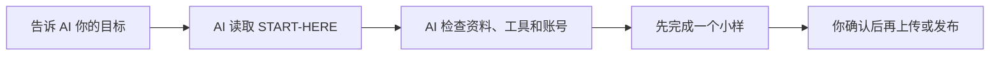

# AI 建站内容运营

把公司的产品资料、客户问题和已有网站交给 AI，让 AI 帮你整理知识、准备文章和图片、写入 CMS 草稿，并检查最后的页面是否真的正确。

你不需要先学会 Obsidian、PicGo、接口或代码。**人负责说清目标、提供资料并批准关键操作；AI 按本子库的执行手册完成检查、制作、验证和记录。**

> **当前版本 `0.4.0-preview.1`（Public Preview，2026-09-03 发布）。** 三张 bundled source card 已逐卡 publication clearance（`approved / PASS / cleared`），`license_status: cleared`。Preview 口径：非 Stable、先单样本、生产动作需用户批准；正式 Stable qualification 继续阻断。实时状态见 [MANIFEST.md](MANIFEST.md)、[VERSION.md](VERSION.md) 与 [LICENSE](LICENSE)。

## 核心优势：全程 API 建站，不依赖浏览器自动化

**正常路径不需要打开浏览器——从建站到发布全程走 HTTP 接口。** 登录、建站、产品、文章、分类、标签、媒体上传（multipart）、页面模块、主题、公开站验收，全部是纯接口调用（操作矩阵 10/10 实测，零浏览器）。相比"模拟人点后台"的浏览器自动化方案：速度快一个量级、可精确回读校验（readback diff）、不依赖页面改版、可串行可审计。

**遇到问题才会打开浏览器，而且是去"摸索"不是去"操作"。** 当接口行为和文档不一致（如平台更新后 action id 变化、新站字段校验差异），AI 按 [AI-START-HERE §0](ADAPTERS/cms/allincms/AI-START-HERE.md) 的会话桥路由打开浏览器做**只读诊断**：复用登录态查真实请求、扫客户端 bundle 重新发现 action id（`scan/scan-actions.py`）、对照官方教程核验——找到根因后**回到接口层修复**并沉淀成新配方。浏览器是探索工具，不是执行通道。

配套的可靠性底座：

- **108 个实测坑位库**（`TOOLS/interface-kit/index/issues.tsv`，现象→根因→修复→规避，可检索）——别的 AI 踩过的坑你不用再踩；
- **合作式审查门**（producer/reviewer 分离 + 30 分钟新鲜 capability + canonical readback 精确比对）——写错会 fail-closed，不会静默破坏站点；
- **发布前后全量校验**（结构/链接/去敏/治理 55 项对抗测试）——交付即审计通过，不是"应该可以"。

## 你可以用它做什么

- 把散落的公司、产品和客户资料整理成 AI 能持续使用的知识；
- 从客户聊天、搜索需求和销售问题中找出值得写的内容；
- 生成文章提纲、产品页、图片说明和 CMS 草稿；
- 在你已有账号、完成登录并明确批准后，把图片和内容写入 AllinCMS，再核对后台字段和前台页面；
- 先做一个样本，确认正确后再批量，失败时留下可追踪记录；
- 更换 CMS、图床或 AI 时保留业务方法，只替换对应的工具接入模块（adapter）。

## 最快开始

### 从零安装（把这段整体复制给你的 AI）

```text
【B2B 建站工具包 · 一键启动】把本块整体复制发给你的 AI。

■ 仓库：https://github.com/tony-apan/b2b-export-ai-workbench-source
■ 要点：
  - 前置：git + Python 3.9+（Skill 安装器）+ Node.js >= 20.9 与 npm（Adapter 依赖/自测必需；PDF/DOCX 解析另选装）；一个 AllinCMS 账号
  - 产出：当前受支持为站点 + 7 产品 + 7 页主题 + 表单绑定；已有 exact-ID 文章可审查后更新。全新文章可本地成稿/评审，但远程 article.create 依 canonical Registry 保持 BLOCK，域名 <site-key>.web.allincms.com
  - 实测参考：干净账号从零到 13 项审计 PASS（时长约半小时量级；内部 Example 实测值，证据在私有运行区，见 RUNBOOK sources）
  - 红线①：删除类操作（站点/产品/文章/分类/标签/主题/媒体，含 delete-demo-content 与任何 --force/--confirm 批量写）逐条列目标等我确认；未经批准不上传、不覆盖、不发布
  - 红线②：token=我的 30 天登录态（不可提前吊销），只进环境变量（手敲 export 前先 set +o history），不写文件不入日志；用完提醒我退出/轮换/改密作废
  - 平台边界：根路径/表单等属平台层，见仓库内 PLAYBOOKS/id-0007-site-launch-acceptance.md 的 C 表（可读）；⛔ 禁令四项=平台层前端审计项，具体是哪四项见仓库 RUNBOOK-ANYONE.md 顶部横幅（可读横幅；图片属性类同属横幅管辖），除此之外永不检查、不报告、不展开

请为我安装并启动，逐步执行并在每步后报告实际输出：
1. 克隆：git clone https://github.com/tony-apan/b2b-export-ai-workbench-source.git && cd b2b-export-ai-workbench-source
2. 一键安装并自测（Windows 用 install.cmd；自动 npm ci + 完整 11 文件自测套件，任一失败打印可修复命令）：python3 sub-libraries/website-content-ops/SKILL-INSTALL/install.py --dir=<你的 skills 目录，可选>
3. 基础自检（应输出 VERIFY PASS；可能出现 remote refs 缺失的 WARN，属正常）：cd sub-libraries/website-content-ops/TOOLS/interface-kit && python3 index/registry_tools.py verify
4. 选装依赖（仅 PDF/DOCX/PPTX/XLSX 解析需要）：cd ../TOOLS/interface-kit && python3 install-deps.py --yes
5. 凭据：token 三种取法（推荐①，专题真源：仓库内 sub-libraries/website-content-ops/ADAPTERS/cms/allincms/docs/TOKEN-AUTH.md）——① 纯 API 登录：我把邮箱+密码直接发你（或我自己 printf 'email\npassword' > <tmp>/ws-creds.txt 后告诉你路径），你登录一次换 token，密码即弃、该临时文件你用完即删，事后提醒我改密；② 兜底：我登录 workspace.laicms.com 后从浏览器 Cookie 复制 payload-token 发你；③ 你从我本地浏览器配置文件提取（方向指引，未实测）。任一方式取到后 export WS_TOKEN=<token>；我一样都不给就停在这里，不要猜、不要碰远程。该 token 等于我的登录态（约 30 天有效且无法提前吊销），只放进环境变量（若你手敲 export，先 set +o history 防落入 shell 历史），不要写 token 文件、不要入日志（方式①的密码临时文件是唯一例外，用完即删）；用完提醒我在平台退出登录，或到期前轮换/改密作废
6. 就绪后：先向我要客户资料（PDF/DOCX/表格/网站/图片均可）与 site-key 偏好（不给则按 ONEPASS 规则生成）；然后读当前目录的 NEW-SITE-ONEPASS.md，按其 13 步建当前受支持站点（文章 create BLOCK 边界以 ONEPASS 为准）；事实与坑查同目录 RUNBOOK-ANYONE.md
7. 批准粒度：13 步内的上传/发布类操作，首次执行前把整批计划列给我批一次即可；删除类（站点/产品/文章/分类/标签/主题/媒体，含 delete-demo-content 与任何 --force/--confirm 批量写）永远逐条列目标等我确认；未经批准不覆盖
（跨平台：macOS/Linux 用 install.py，Windows 用 install.cmd + WS_TOKEN 环境变量；若你的执行环境每条命令独立 shell，cd 不持久，请自行换算为绝对路径）
```

> 已经在用 AI 技能生态（Claude/Codex skills）？把 `sub-libraries/website-content-ops/SKILL-INSTALL/` 软链到你的 skills 目录即可注册本能力（详见 [SKILL-INSTALL/README](SKILL-INSTALL/README.md) 的安装段与双真源警示）。

#### 要点速览（给人看；上面的 text 块是给 AI 复制用的）

| 要点 | 内容 |
|---|---|
| 前置条件 | git + Python 3.9+（Skill 安装器）+ Node.js >= 20.9 + npm（Adapter 依赖/自测必需；PDF/DOCX 解析选装）；一个 AllinCMS 账号取 token（30 天登录态） |
| 实测时长 | 干净账号从零到 13 项审计 PASS ≈ **25 分钟** |
| 产出 | 当前受支持：站点 + 7 产品 + 7 页主题 + 表单绑定；已有 exact-ID 文章可 reviewed update。全新文章本地成稿/评审可完成，远程 article.create Registry BLOCK |
| 关键入口 | [13 步一条龙](TOOLS/interface-kit/NEW-SITE-ONEPASS.md) · [事实与坑库](TOOLS/interface-kit/RUNBOOK-ANYONE.md) · [166+ 字段清单](TOOLS/interface-kit/templates/new-site-customization-checklist.md) · [token 三种取法](ADAPTERS/cms/allincms/docs/TOKEN-AUTH.md) |
| 两条红线 | 删除类与 `--force/--confirm` 批量写逐条确认；token=登录态，只进环境变量不落盘 |
| 平台边界 | 根路径/表单/图片属性等平台层行为见 [ID-0007 C 表](PLAYBOOKS/id-0007-site-launch-acceptance.md)（⛔ 禁令四项永不涉及） |

### 已经把工作包交给 AI 了？（原有定位提示）



### 你只需要做两件事

1. 把本目录交给一个能够读取和修改本地文件的 AI，例如 Codex；
2. 把下面这段话发给它：

```text
请把这个目录作为“AI 建站内容运营”工作包。
先读取 AGENTS.md、START-HERE.md 和 MANIFEST.md，不要扫描无关目录。

先用大白话告诉我：
1. 你可以帮我完成什么；
2. 你现在还缺哪些资料、账号或权限；
3. 你准备先做哪个最小样本；
4. 哪些操作必须等我确认后才能执行。

随后按 START-HERE.md 执行。没有账号、登录失效或权限不清时不要猜：
停止远程 CMS 操作，提醒我查看 README.md 的“没有 AllinCMS 账号”部分；
本地资料整理和小样可以继续，但远程结果必须标记为未执行。
未经我明确批准，不要上传、覆盖、删除或发布任何内容。
```

### AI 能直接执行吗？

**可以，但取决于当前 AI 的工具权限。**

- 只整理资料、生成知识卡、文章和图片清单：需要读取和写入本地文件；
- 检查网站和 CMS：需要浏览器或可审计的接口工具；
- 运行 AllinCMS adapter：需要 Node.js、对应脚本环境，以及用户已经登录并确认准确站点；
- 上传、覆盖、删除和发布：必须取得用户针对本次操作的明确批准。

AI 的具体执行顺序、检查命令、停止条件和第一条指令都在 [START-HERE.md](START-HERE.md)。这份文件主要给 AI 读，人不需要逐条理解里面的技术细节。

## 没有 AllinCMS 账号？

如果你还没有账号、没有开通网站，或者不知道应该进入哪个站点，可以微信联系 Tony。添加时建议备注：**建站内容运营 / AllinCMS**。


[二维码无法显示时，点这里打开原图](https://cos.files.maozhishi.com/data/web/web-files/wx/tony-apan.png)。更多支持边界见 [CONTACT.md](CONTACT.md)。

> 二维码只是公开联系入口，不是登录凭据。请不要把密码、Cookie、Token 或客户隐私通过公开仓库提交。

## 它是怎么工作的


这不是某个软件的按钮课。稳定部分是公司、产品、客户、内容、图片、发布和验证；Obsidian、AllinCMS、PicGo、R2、COS、OSS 等工具变化都放在 adapter 中。

## AllinCMS 图片怎么处理

当目标是 AllinCMS 媒体库时，AI 默认按以下路线执行：

`逐张读图 → 用户确认文件和站点 → 串行上传 → 自动刷新验收 → 写入私有图片索引 → 下一张`

不需要先配置 PicGo 或外部图床。完整优先级、授权、失败恢复和停止条件见：

- [图片上传统一路由](ADAPTERS/image-upload-routing.md)
- [AllinCMS AI 唯一入口](ADAPTERS/cms/allincms/AI-START-HERE.md)
- [AllinCMS adapter README](ADAPTERS/cms/allincms/README.md)
- [AllinCMS 接口索引（人类/AI）](ADAPTERS/cms/allincms/INTERFACE-INDEX.md)；机器真源为 [interface-registry.json](ADAPTERS/cms/allincms/interface-registry.json)

R2、GitHub、腾讯云 COS 和阿里云 OSS 只在需要跨系统公开 URL、迁移练习或用户明确指定时使用。

## 三种使用方式

| 你是谁 | 从哪里开始 | 主要内容 |
|---|---|---|
| 业务人员或新手 | 本 README → [START-HERE.md](START-HERE.md) | 把目标交给 AI，由 AI 带着完成第一条小样 |
| 内容运营或实施人员 | [RUNTIME-INTEGRATION.md](RUNTIME-INTEGRATION.md) → [WORKSPACE-TEMPLATE/README.md](WORKSPACE-TEMPLATE/README.md) | 先在 agency-operations 建立有 client/company/task 绑定的私有运行区，再加载内容能力投影 |
| AI 或技术人员 | [AGENTS.md](AGENTS.md) → [SKILL.md](SKILL.md) → [ADAPTERS/README.md](ADAPTERS/README.md) | 读取运行合同、调用 adapter、执行验证和处理失败 |

这不是只给 AI 一条提示词的“技能文件”。它是一整套工作包，包含人类说明、AI 执行入口、模板、示例、客户工作区、工具接入模块和验证工具。[SKILL.md](SKILL.md) 只是其中一个 AI 入口，目前还不能当作已正式发布的一键安装 Skill。

## 建站一条龙（AllinCMS 纯 API）

```mermaid
flowchart LR
    P0[步骤0 索引 preflight: verify + find] --> A[客户资料 PDF/DOCX/表格/网站]
    A --> B[brief.json 提炼+validate]
    B --> C[COP 内容计划 数量/主题/FAQ/CTA 基线]
    C --> D[create_site 只建站不填内容 + 默认主题]
    D --> E[媒体上传 upload_media]
    E --> F[分类/标签创建]
    F --> G[产品/文章 upsert 到位]
    G --> H[主题 7 页 + globals save/publish]
    H --> X[步骤4 改造清单: 166+ 字段逐项核对]
    X --> Y[步骤11 demo 种子清理: 删除演示内容(需删除授权)]
    Y --> I[路由 → 激活 → set_home_page 收尾]
    I --> J[audit 13 项 每站 --config 基线]
    J --> K{全 PASS?}
    K -- 否 --> L[回填 issues.tsv 重修]
    L --> J
    K -- 是 --> M[DELIVERY + HANDOFF 交付]
```

入口链：[NEW-SITE-ONEPASS.md](TOOLS/interface-kit/NEW-SITE-ONEPASS.md)（13 步）→ [RUNBOOK-ANYONE.md](TOOLS/interface-kit/RUNBOOK-ANYONE.md)（实测事实+回落库）→ [new-site-customization-checklist.md](TOOLS/interface-kit/templates/new-site-customization-checklist.md)（字段逐项改）→ [API-DISCOVERY.md](TOOLS/interface-kit/API-DISCOVERY.md)（平台更新后重摸索）。AI Skill 安装入口见 [SKILL-INSTALL/](SKILL-INSTALL/README.md)。

## 常用入口

| 你要做什么 | 入口 |
|---|---|
| 让 AI 开始执行 | [START-HERE.md](START-HERE.md) |
| 没有账号或需要支持 | [CONTACT.md](CONTACT.md) |
| 跟着虚拟公司演示 | [FluxPedal Motors](EXAMPLES/fluxpedal-motors/README.md) |
| 建立客户私有工作区 | [RUNTIME-INTEGRATION.md](RUNTIME-INTEGRATION.md) |
| 用纯 API 从零建一个 AllinCMS 网站 | [interface-kit 工具包](TOOLS/interface-kit/README.md) → [NEW-SITE-ONEPASS.md](TOOLS/interface-kit/NEW-SITE-ONEPASS.md)（13 步一条龙，零第三方依赖） |
| 把本能力作为 AI Skill 安装 | [SKILL-INSTALL/](SKILL-INSTALL/README.md)（allincms-bulk-content-upload 合并后的唯一真源；旧独立仓已封存） |
| 收集最少必要资料 | [INTAKE.md](INTAKE.md) |
| 理解公司、产品、客户和内容的关系 | [MENTAL-MODEL.md](MENTAL-MODEL.md) |
| 查看完整执行流程 | [PLAYBOOK.md](PLAYBOOK.md) |
| 从空白规划和审查正式 B2B SEO 文章 | [PLAYBOOKS/README.md](PLAYBOOKS/README.md) → [B2B SEO Article Standard](PLAYBOOKS/id-0001-b2b-seo-article-standard.md) |
| 优化已有 B2B 文章 | [B2B Article Optimization SOP](PLAYBOOKS/id-0003-b2b-article-optimization-sop.md)；质量闸仍以 ID-0001 为准 |
| 查看课程路径 | [COURSE-MAP.md](COURSE-MAP.md) |
| 选择模板 | [TEMPLATES/README.md](TEMPLATES/README.md) |
| 接入 CMS 或图床 | [ADAPTERS/README.md](ADAPTERS/README.md) |
| 判断结果是否通过 | [QA-CHECKLIST.md](QA-CHECKLIST.md) |
| 查看输入、输出、权限和回滚合同 | [RUNTIME-CONTRACT.json](RUNTIME-CONTRACT.json) |
| 查看包含范围和发布阻断 | [MANIFEST.md](MANIFEST.md) |
| 查看安装、升级和回滚 | [INSTALL.md](INSTALL.md) |
| 查看版本变化 | [CHANGELOG.md](CHANGELOG.md) |

## 人和 AI 都必须遵守的边界

- 真实客户资料、账号环境、图片索引和经营数据放在客户私有运行区，不提交回公开子库；
- 密码、Cookie、Token 和 Secret 不写进 Markdown，也不发到公开 Issue；
- AI 可以检查和准备，但上传、覆盖、删除和发布必须按具体对象重新取得批准；
- 正式文章必须走 `Brief → Draft → Quality Review → Frontend SEO → CMS Adapter → Publish Record`，总分和 API 成功都不能覆盖一票否决；
- 先跑一个样本并检查真实结果，不把“命令成功”或 HTTP 200 当成业务完成；
- 登录失效、站点不确定、权限不清、结果不明确或无法回滚时立即停止。

## 当前发布结论

**既有 `v0.3.2-preview.1` Public Preview 可用；当前源码候选：`BLOCK`；Stable：`BLOCK`。** 本地结构、模板、虚拟示例、治理脚本和 AllinCMS Adapter 的既有机械测试与限定环境证据仍保留，但 AllinCMS official、PicGo image-host official 与 B2B SEO content research 三张 bundled source card 的 publication/license clearance 均未闭合。许可审批、正式 qualification、真人批准和跨部署稳定性未闭合前，不得重新发布当前候选，也不得宣称 production-ready 或适用于所有 CMS 部署。
