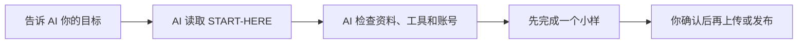
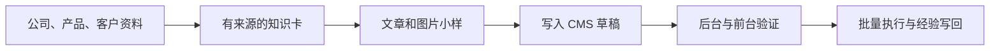

# AI 建站内容运营

把公司的产品资料、客户问题和已有网站交给 AI，让 AI 帮你整理知识、准备文章和图片、写入 CMS 草稿，并检查最后的页面是否真的正确。

你不需要先学会 Obsidian、PicGo、接口或代码。**人负责说清目标、提供资料并批准关键操作；AI 按本子库的执行手册完成检查、制作、验证和记录。**

> **当前已发布为 Public Preview；不是 Stable 或 production-ready。** 你可以下载后交给 AI 做本地试用和单样本；请先验证一条内容和一张图片，不要未经确认直接批量用于生产。实时状态与许可证见 [MANIFEST.md](MANIFEST.md) 和 [LICENSE](LICENSE)。

## 你可以用它做什么

- 把散落的公司、产品和客户资料整理成 AI 能持续使用的知识；
- 从客户聊天、搜索需求和销售问题中找出值得写的内容；
- 生成文章提纲、产品页、图片说明和 CMS 草稿；
- 在你已有账号、完成登录并明确批准后，把图片和内容写入 AllinCMS，再核对后台字段和前台页面；
- 先做一个样本，确认正确后再批量，失败时留下可追踪记录；
- 更换 CMS、图床或 AI 时保留业务方法，只替换对应的工具接入模块（adapter）。

## 最快开始



### 你只需要做两件事

1. 把本目录交给一个能够读取和修改本地文件的 AI，例如 Codex；
2. 把下面这段话发给它：

```text
请把这个目录作为“AI 建站内容运营”工作包。
先读取 AGENTS.md、START-HERE.md 和 MANIFEST.md，不要扫描无关目录。

先用大白话告诉我：
1. 你可以帮我完成什么；
2. 你现在还缺哪些资料、账号或权限；
3. 你准备先做哪个最小样本；
4. 哪些操作必须等我确认后才能执行。

随后按 START-HERE.md 执行。没有账号、登录失效或权限不清时不要猜：
停止远程 CMS 操作，提醒我查看 README.md 的“没有 AllinCMS 账号”部分；
本地资料整理和小样可以继续，但远程结果必须标记为未执行。
未经我明确批准，不要上传、覆盖、删除或发布任何内容。
```

### AI 能直接执行吗？

**可以，但取决于当前 AI 的工具权限。**

- 只整理资料、生成知识卡、文章和图片清单：需要读取和写入本地文件；
- 检查网站和 CMS：需要浏览器或可审计的接口工具；
- 运行 AllinCMS adapter：需要 Node.js、对应脚本环境，以及用户已经登录并确认准确站点；
- 上传、覆盖、删除和发布：必须取得用户针对本次操作的明确批准。

AI 的具体执行顺序、检查命令、停止条件和第一条指令都在 [START-HERE.md](START-HERE.md)。这份文件主要给 AI 读，人不需要逐条理解里面的技术细节。

## 没有 AllinCMS 账号？

如果你还没有账号、没有开通网站，或者不知道应该进入哪个站点，可以微信联系 Tony。添加时建议备注：**建站内容运营 / AllinCMS**。


[二维码无法显示时，点这里打开原图](https://cos.files.maozhishi.com/data/web/web-files/wx/tony-apan.png)。更多支持边界见 [CONTACT.md](CONTACT.md)。

> 二维码只是公开联系入口，不是登录凭据。请不要把密码、Cookie、Token 或客户隐私通过公开仓库提交。

## 它是怎么工作的



这不是某个软件的按钮课。稳定部分是公司、产品、客户、内容、图片、发布和验证；Obsidian、AllinCMS、PicGo、R2、COS、OSS 等工具变化都放在 adapter 中。

## AllinCMS 图片怎么处理

当目标是 AllinCMS 媒体库时，AI 默认按以下路线执行：

`逐张读图 → 用户确认文件和站点 → 串行上传 → 自动刷新验收 → 写入私有图片索引 → 下一张`

不需要先配置 PicGo 或外部图床。完整优先级、授权、失败恢复和停止条件见：

- [图片上传统一路由](ADAPTERS/image-upload-routing.md)
- [AllinCMS AI 唯一入口](ADAPTERS/cms/allincms/AI-START-HERE.md)
- [AllinCMS adapter README](ADAPTERS/cms/allincms/README.md)

R2、GitHub、腾讯云 COS 和阿里云 OSS 只在需要跨系统公开 URL、迁移练习或用户明确指定时使用。

## 三种使用方式

| 你是谁 | 从哪里开始 | 主要内容 |
|---|---|---|
| 业务人员或新手 | 本 README → [START-HERE.md](START-HERE.md) | 把目标交给 AI，由 AI 带着完成第一条小样 |
| 内容运营或实施人员 | [WORKSPACE-TEMPLATE/README.md](WORKSPACE-TEMPLATE/README.md) | 建客户私有运行区，管理资料、任务、输出、指标和写回 |
| AI 或技术人员 | [AGENTS.md](AGENTS.md) → [SKILL.md](SKILL.md) → [ADAPTERS/README.md](ADAPTERS/README.md) | 读取运行合同、调用 adapter、执行验证和处理失败 |

这不是只给 AI 一条提示词的“技能文件”。它是一整套工作包，包含人类说明、AI 执行入口、模板、示例、客户工作区、工具接入模块和验证工具。[SKILL.md](SKILL.md) 只是其中一个 AI 入口，目前还不能当作已正式发布的一键安装 Skill。

## 常用入口

| 你要做什么 | 入口 |
|---|---|
| 让 AI 开始执行 | [START-HERE.md](START-HERE.md) |
| 没有账号或需要支持 | [CONTACT.md](CONTACT.md) |
| 跟着虚拟公司演示 | [FluxPedal Motors](EXAMPLES/fluxpedal-motors/README.md) |
| 建立客户私有工作区 | [WORKSPACE-TEMPLATE/README.md](WORKSPACE-TEMPLATE/README.md) |
| 收集最少必要资料 | [INTAKE.md](INTAKE.md) |
| 理解公司、产品、客户和内容的关系 | [MENTAL-MODEL.md](MENTAL-MODEL.md) |
| 查看完整执行流程 | [PLAYBOOK.md](PLAYBOOK.md) |
| 查看课程路径 | [COURSE-MAP.md](COURSE-MAP.md) |
| 选择模板 | [TEMPLATES/README.md](TEMPLATES/README.md) |
| 接入 CMS 或图床 | [ADAPTERS/README.md](ADAPTERS/README.md) |
| 判断结果是否通过 | [QA-CHECKLIST.md](QA-CHECKLIST.md) |
| 查看输入、输出、权限和回滚合同 | [RUNTIME-CONTRACT.json](RUNTIME-CONTRACT.json) |
| 查看包含范围和发布阻断 | [MANIFEST.md](MANIFEST.md) |
| 查看安装、升级和回滚 | [INSTALL.md](INSTALL.md) |
| 查看版本变化 | [CHANGELOG.md](CHANGELOG.md) |

## 人和 AI 都必须遵守的边界

- 真实客户资料、账号环境、图片索引和经营数据放在客户私有运行区，不提交回公开子库；
- 密码、Cookie、Token 和 Secret 不写进 Markdown，也不发到公开 Issue；
- AI 可以检查和准备，但上传、覆盖、删除和发布必须按具体对象重新取得批准；
- 先跑一个样本并检查真实结果，不把“命令成功”或 HTTP 200 当成业务完成；
- 登录失效、站点不确定、权限不清、结果不明确或无法回滚时立即停止。

## 当前发布结论

**Public Preview：`Published`；Stable：`BLOCK`。** Apache-2.0 许可证边界已明确，本地结构、模板、虚拟示例、发布治理脚本和 AllinCMS Adapter 已有机械测试与限定环境证据；但正式 qualification、真人批准、跨部署稳定性和一键安装 Skill 仍未完成。当前只能宣称 Preview，不能宣称 Stable、production-ready 或适用于所有 CMS 部署。
