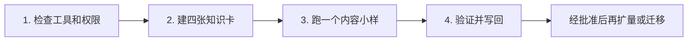

# AI 执行入口

> **本页主要给 AI agent 读取和执行。** 人类用户不需要逐条操作，只需要说明目标、提供必要资料、在自己的浏览器中完成登录，并对上传、覆盖、删除或发布分别确认。不要向 AI 发送密码、Cookie、Token 或 Secret。

## 开始前先声明能力

AI 必须先检查并用大白话告诉用户：

- 是否能读取和写入本地文件；
- 是否能使用浏览器、Node.js 和本目录脚本；
- 是否已经看到用户指定的准确站点和页面；
- 哪些步骤可以立即执行，哪些需要用户登录、补资料或批准；
- 如果当前宿主 AI 缺少工具，明确报告不可执行，不得假装完成。

没有 AllinCMS 账号、没有开通网站或无法确认站点时，不要代替用户注册、猜测站点或尝试绕过登录。停止远程 CMS 路线，并提醒用户查看 [README 的联系入口](README.md#没有-allincms-账号) 或 [CONTACT.md](CONTACT.md)；如果本地资料足够，可继续完成不产生远程副作用的小样，并把远程步骤标记为 `BLOCK / not executed`。

## 按四步执行



## 1. 检查工具和权限

AI 执行：

1. 读取 `AGENTS.md`、`MANIFEST.md` 和目标 adapter 入口，不扫描无关目录；
2. 检查本地 Markdown、客户运行区、Node.js 和所需脚本是否可用；
3. 如果用户使用 Obsidian，只需确认它能打开目标目录；Obsidian 不是强制依赖；
4. 若目标是 AllinCMS，让用户完成登录并确认准确的 `https://workspace.laicms.com/{site_key}/media`；
5. 运行 AllinCMS 只读环境预检，不读取或导出 Cookie、Token 和密钥；
6. 只有用户明确需要外部图床时，才检查 PicGo 以及 R2、GitHub、腾讯云 COS、阿里云 OSS；
7. 汇总可执行项、缺失项、风险和下一步，等待必要批准。

> **AllinCMS 媒体库默认直接上传。** 使用 [图片上传统一路由](ADAPTERS/image-upload-routing.md) 和 [AllinCMS AI 唯一入口](ADAPTERS/cms/allincms/AI-START-HERE.md)。不需要先配置 PicGo、R2 或 GitHub。外部图床只作为跨系统公开 URL、迁移练习或用户明确指定时的备选。

安装、升级、改配置、创建 bucket、上传和发布都必须先得到用户确认。已获得某次上传授权，不等于获得删除、覆盖或发布授权。

## 2. 建四张知识卡

只建立：公司、产品、ICP、客户语言。每条信息标记 `confirmed / inferred / missing / conflicting / expired`，并保留来源指针。

资料不足时先列出真正阻断小样的问题，不进行无边界访谈。没有真实资料时，可从 [FluxPedal Motors 虚拟演示](EXAMPLES/fluxpedal-motors/README.md)开始，但必须明确标记为 synthetic，不得写成真实客户证据。

## 3. 跑一个内容小样

先完成一条最小闭环：

- 一份客户聊天到搜索意图的 article brief；
- 一张图片和 image manifest；
- 若用户已明确批准并具备 AllinCMS 环境，通过 `uploadAllinCmsMediaSerial()` 上传一张图片；
- 获得一一对应的 media ID、公开 URL、源 / 上传 / 远端哈希和本地私有图片索引；
- 建立一条 CMS 草稿，不直接发布。

如果没有账号或没有获得上传批准，仍可完成本地 brief、image manifest 和模拟 CMS 草稿，但必须把远程上传与真实页面验证标记为 `BLOCK / not executed`，不得伪造 media ID 或 URL。

每张真实图片必须按“接口上传 → 自动刷新 → 全链验证 → 原子写索引”完成后再进入下一张。结果不明确时只读对账，不自动重传。

## 4. 验证并写回

验证页面、图片、字段和状态；记录失败、指标和人工判断。客户事实与 `image-index.json` 留在客户私有运行区，通用模板和 adapter 改进审核后写回母库。

只有当前样本通过并获得用户对下一批精确对象的批准后，才能扩大批次或迁移到第二工具。不能把一次样本通过外推为跨站点、跨部署稳定。

## 第一条 AI 指令

```text
请读取 README.md、AGENTS.md、START-HERE.md、MANIFEST.md，
以及与当前任务最相关的 adapter 入口，不要扫描无关目录。

先声明你当前能否读取/写入文件、使用浏览器和运行 Node.js 脚本。
然后只执行第 1 步“检查工具和权限”，不要安装、升级、改配置、上传或发布。

如果目标是 AllinCMS：
1. 让用户确认已经登录并打开准确的 /{site_key}/media；
2. 运行 checkAllinCmsMediaRuntime()；
3. 告诉用户 WebP 是否可直接传，以及 PNG/JPG 是否缺 sharp；
4. 准备客户私有 image-index.json 路径；
5. 列出本次准备上传的精确文件；
6. 等用户批准后再调用 uploadAllinCmsMediaSerial()。

没有账号、站点不确定或权限不清时停止，提醒用户查看 README.md 的联系入口。
不要先让用户选择 PicGo 或外部图床；只有用户明确需要外部公开图床时，
再提供 R2、GitHub、COS、OSS 备选。
```

## 停止条件

出现以下任一情况时立即停止并标记 `BLOCK`：

- AI 无法读取必要文件、使用所需工具或验证真实结果；
- 没有账号、登录失效、站点 key 不确定或权限不清；
- 接口漂移、索引锁、索引写入失败或结果不明确；
- 来源冲突、未知版权、目标文件与授权文件不一致；
- 当前步骤需要上传、覆盖、删除或发布，但用户尚未批准；
- 操作无法验证或无法回滚。

不得自动改走 UI、PicGo、其他图床或另一个站点来绕过阻断。远程 CMS 步骤被阻断时，可以继续本地整理和模拟草稿，但必须清楚标记未执行范围，不能把局部 BLOCK 写成整个任务已经完成。
