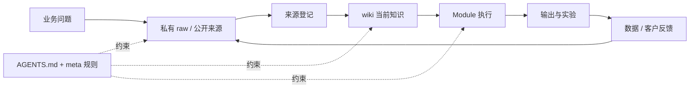

# Knowledge Compounding System

## TL;DR

本项目只维护**一个知识底座**。SEO、独立站、来发信主动开发、社媒、课程等都是 Module；它们先读取同一套业务知识，执行后再把新来源、数据、客户语言、失败和结论回写回来。

工具可以替换，知识库必须持续存在。当前阶段不引入复杂 RAG 或向量数据库，先把 Markdown、来源、索引、链接和回写跑通。



## 1. 四个职责层

| 层 | 本仓库位置 | 职责 | 不应该做什么 |
|---|---|---|---|
| 原始证据 | 私有 `raw/`；公开库仅占位 | 保存网页、转写、导出、截图说明、客户原话和数据快照 | 不直接写 AI 结论；不公开敏感资料 |
| 来源层 | `wiki/10_sources/` | 登记来源、日期、可信度、适用范围和更新去向 | 不替代原文；不把二手说法冒充官方 |
| 当前知识 | `wiki/20_concepts/`、`wiki/40_business/`、`wiki/50_channels/` | 保存当前最好理解、关系、冲突和待验证项 | 不保存无法追溯的强结论 |
| 执行与反馈 | `wiki/30_playbooks/`、`wiki/80_metrics/`、`wiki/90_outputs/` | 把知识变成动作，再用结果验证 | 不让产出和数据停留在模块孤岛 |

`AGENTS.md` 和 `wiki/00_meta/` 是协议层，决定 AI 如何读取、写入、校验和归档以上四层。

## 2. 每次工作的唯一闭环

1. **提出问题**：先写清要解决的业务问题，不先选工具或生成内容。
2. **收集证据**：优先官方资料、真实客户语言、业务数据和一手实验。
3. **登记来源**：来源进入 source registry；不确定内容进入 open questions。
4. **更新知识**：修改已有 concept、business 或 channel 页面，建立交叉链接；新来源若挑战旧结论，要明确记录冲突。
5. **执行 Module**：调用对应 playbook，产出页面、邮件、销售动作、内容或实验。
6. **验证并回写**：把搜索、点击、询盘、回复、成交、失败原因和人工判断回写到来源、指标与当前知识。

没有第 6 步，就只有内容生产，没有知识积累。

## 3. 知识如何落位

| 新发现 | 写入位置 |
|---|---|
| 外部原文、客户原话、数据快照 | 私有 `raw/` |
| 来源是谁、何时获取、可靠度 | `wiki/10_sources/` |
| 术语、搜索意图、采购逻辑、通用判断 | `wiki/20_concepts/` |
| ICP、产品、offer、证据、异议、客户语言 | `wiki/40_business/` |
| 可重复执行步骤 | `wiki/30_playbooks/` |
| 某渠道的状态、机会和 backlog | `wiki/50_channels/` |
| 实验定义和验证数据 | `wiki/80_metrics/` |
| 页面、文案、brief、案例等产物 | `wiki/90_outputs/` |
| 还不能确认的问题 | `wiki/00_meta/open-questions.md` |

## 4. 最小可信度规则

每个长期页面至少维护：

- `sources`：依据来自哪里。
- `status`：Seed / Draft / Working / Canonical / Stale。
- `last_updated`：最后一次实质更新日期。
- `confidence`：当前可信度；没有时在正文标注“待验证”。
- `review_after`：对规则、工具和平台等易变信息设置复查日期。

关键结论最好在相邻段落直接指出来源。来源矛盾时保留旧说法和新证据，不静默覆盖。

## 5. Module 的统一接口

以后逐个梳理 Module 时，至少回答八个问题：

1. 这个 Module 解决哪个业务结果？
2. 它从知识库读取哪些事实和 playbook？
3. 它新增哪些原始来源或市场信号？
4. 它使用哪些可替换工具和 adapter？
5. 它产出什么结构化文件和外部动作？
6. 哪些动作必须人工审批，失败如何回滚？
7. 如何验证成功？
8. 结果写回客户运行区、私有母库还是公开子库？

Module 不另建一套重复的私有母库。分发给客户的子库可以创建独立客户运行区，但客户事实默认不自动回传；工具按钮和平台差异只写在可替换 adapter 层。

## 6. SEO：第一个搜索需求发现 Module

SEO 同时是获客渠道和低成本市场研究系统：

| SEO 信号 | 先说明什么 | 应沉淀到知识库 |
|---|---|---|
| Search Console query | 用户真实使用的语言和问题 | 搜索意图、术语、FAQ、客户痛点 |
| impressions / position | Google 是否认为页面与主题相关 | 主题机会、页面覆盖缺口、待验证假设 |
| clicks / CTR | 标题、承诺和意图匹配度 | messaging、标题模式、内容结构 |
| landing-page behavior / conversion | 内容是否吸引了正确 ICP | offer fit、CTA、页面路径 |
| 询盘与销售反馈 | 搜索需求是否有商业价值 | ICP、异议、产品事实、proof library |
| 竞品与 SERP 变化 | 市场如何解释同一问题 | 竞品页、内容差距、差异化判断 |

执行方法不是“批量写文章”，而是：

`搜索问题 -> 建立知识假设 -> 用原始证据完成页面 -> 发布 -> 用 GSC/Analytics/询盘验证 -> 回写知识库`

Google 当前官方指南也强调：AI 搜索仍建立在 SEO 基础之上，应优先可抓取、可索引、独特且非同质化的 people-first 内容；不需要为 AI Search 盲目制造大量关键词变体、特殊 chunk 或 Google 不使用的 `llms.txt` 捷径。

## 7. 从知识积累到能力迁移

知识库的最终产物不是更多按钮教程，而是可以被人和 AI 迁移的稳定模型。每个 Module 都应把知识组织成以下链路：

```text
业务目标 → 核心对象与字段 → 转换规则 → 可替换接口
→ 单样本 → 验证 → 失败诊断 → 数据与方法写回
```

稳定层和易变层必须分开：

| 稳定层 | 易变层 | 维护方式 |
|---|---|---|
| 业务目标、客户任务、内容模型、字段语义、质量闸、审批和写回 | 按钮位置、菜单名称、API 版本、插件配置、平台限制 | 稳定层进入 wiki / playbook / templates；易变层进入 adapter 并设置复查日期 |

因此，每个可教学 Module 必须包含：

1. **底层解释**：为什么这样做，输入、输出和判断标准是什么；
2. **工具中立模型**：对象、字段、状态、接口、权限、验证和回滚；
3. **参考实现**：选择一套现实工具跑通完整闭环；
4. **迁移练习**：让 AI 调查陌生工具并建立字段与接口映射，或把同一知识映射到相邻业务任务，再跑一个样本；
5. **能力验收**：学习者能解释、映射、执行、验证、诊断和迁移，而不只是复现演示。

AI 面对陌生工具时，不应先生成按钮教程。应先识别它解决的问题、核心对象和字段，检查 GUI、API、CSV、CLI、MCP 或浏览器操作等接口，再把本库稳定模型映射过去。任何批量动作都必须在单样本和回滚验证之后。

跨业务迁移同样不能直接复制产物。例如公司与产品知识可以复用于 SEO、社媒和主动营销，但每个渠道的受众情境、内容形态、权限、节奏和成功指标必须重新映射；共享的是知识底座和推理方法，不是把一篇文章原样贴到所有渠道。

## 8. 当前边界

- 当前公开仓库不能保存真实课程、客户、账号或经营数据，因此它是“公开编译层”，不是完整原始知识库。
- 真正要让知识持续复利，需要一个私有 raw 来源层；但在确定工具和存储位置前，本仓库只定义接口，不擅自创建或迁移私有资料。
- SEO 已作为第一个“搜索需求发现与内容验证” Module 建立；第一个对外交付并跑真实工具链的子库改为 Website Content Operations。先完成网站盘点、公司产品建库、PicGo、CMS、浏览器验收和写回，再复制到社媒、主动营销等子库。
