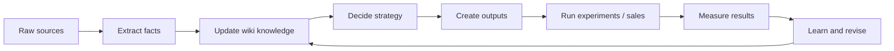

# Growth Wiki Methodology

这个知识库不是资料仓库，而是一个增长操作系统。它把原始资料和官方规则持续转成业务判断、渠道动作、实验记录和可复用输出。

## 核心循环

## 七步方法论

1. Source：先找到事实来源，优先使用 `raw/`、官方来源卡和已登记 source。
2. Extract：提取客户原话、数字、场景、触发事件、异议、结果、风险和平台规则。
3. Model：更新 ICP、offer、messaging、proof、渠道策略等核心模型。
4. Decide：用证据等级和当前目标做选择，不把所有可能性都同时推进。
5. Execute：生成页面、帖子、邮件、brief、广告或销售话术。
6. Measure：按统一指标口径记录表现和质量。
7. Learn：把结果回流到 wiki，更新方法论、模板和 playbook。

## 三层证据结构

| Layer | Meaning | Examples | Rule |
|---|---|---|---|
| Rule layer | 官方规则、平台边界、合规要求 | Google Search Central、Google Ads Help、OpenAI crawlers、LinkedIn Help | 优先级最高，决定能不能这么做 |
| Tool layer | 工具数据和平台报表 | SEMrush、GSC、GA4、Ads、Bing Webmaster、server logs | 用于诊断和验证，不当成绝对真相 |
| Business layer | 业务事实和市场反馈 | ICP、offer、proof、客户反馈、销售结果 | 决定什么值得做和怎么表达 |

## 决策层级

| 层级 | 回答的问题 | 主要页面 | 输出 |
|---|---|---|---|
| Business | 我们服务谁，卖什么，为什么可信？ | [Business](../40_business/index.md) | ICP、offer、messaging、proof |
| Channel | 用什么渠道触达，目标是什么？ | [Channels](../50_channels/index.md) | 渠道 brief、优先级 |
| Playbook | 具体怎么做？ | [Playbooks](../30_playbooks/index.md) | SOP、检查清单、模板 |
| Experiment | 如何验证？ | [Metrics](../80_metrics/index.md) | 实验记录、决策规则 |
| Output | 对外发什么？ | [Outputs](../90_outputs/index.md) | 页面、帖子、邮件、广告、提案 |

## 证据等级

| Level | 证据类型 | 可以支持的决策 |
|---|---|---|
| L0 | 无来源想法 | 只能写成假设或待验证 |
| L1 | 单一原始资料或一次客户反馈 | 可以生成草稿或问题 |
| L2 | 多个来源一致，或官方规则 + 合理业务推断 | 可以更新 playbook 或 messaging |
| L3 | 有数据、成交结果或多轮平台测试支持 | 可以作为渠道决策依据 |
| L4 | 多轮验证且持续有效 | 可以标为 Canonical |

## 渠道协同原则

- 所有渠道共用同一个 [Messaging House](../40_business/messaging-house.md)。
- 每个 claim 必须连接到证据资产或标注待验证。
- Website 承接信任和转化，LinkedIn 建立关系和观点，Email 做精准触达，SEO 建长期需求入口，GEO 建 AI 搜索可见性，SEM/Ads 做快速测试与放大。
- 不同渠道可以表达不同，但不能承诺互相冲突。
- 付费投放学到的 search terms、creative、objections 要回流到 SEO、LinkedIn、网站和开发信。
- SEO/GEO/社媒产生的高意图问题要回流到销售话术和 FAQ。

## 不能越过的门槛

- 没有 ICP，不做强定位结论。
- 没有 offer 边界，不写强销售承诺。
- 没有 proof，不写确定性结果。
- 没有指标口径，不比较渠道成败。
- 没有实验基线，不声称优化有效。
- 没有官方规则或来源，不把平台策略写成确定结论。
- 没有转化追踪，不启动付费投放。
- 没有多次测试，不声称 AI 搜索趋势。