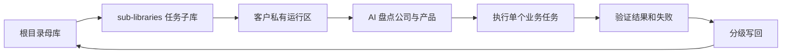

# 母库与可发布子库模型

## 已拍板结构

Tony 于 2026-07-27 确认：

1. 当前仓库根目录作为母库；
2. `sub-libraries/` 中的任务文件夹作为可独立发布子库；
3. 第一家虚拟演示公司使用电动自行车电机出口业务；
4. PicGo 图床课程覆盖 Cloudflare R2、GitHub、腾讯云 COS 和阿里云 OSS。

这里的“母库”是**逻辑和发布源码的 source of truth**。由于当前 GitHub 远程仍为 `PUBLIC`，本仓库只承载公开安全知识和虚拟演示；真实客户、账号、课程原文和经营数据仍不得提交。

## 根目录母库负责什么

母库统一保存：

- 官方来源与来源登记；
- 公司、产品、客户、外贸、沟通和增长的稳定模型；
- SEO、GEO、SEM、独立站、社媒、主动营销等 Module 源码；
- 工具调查方法、adapter 合同、模板和质量闸；
- 虚拟演示、失败诊断、指标口径和版本历史；
- 子库发布合同、品牌注入、许可和更新规则。

母库不要求用户从头读到尾。AI 通过索引和任务路由，只读取当前步骤需要的最小知识集。

## 三个运行层

| 层 | 位置 | 放什么 | 不能放什么 |
|---|---|---|---|
| 根目录母库 | 当前仓库根目录 | 通用方法、来源、模型、Module 源码、虚拟演示、发布规则 | 明文凭据、未授权材料、被冒充为真实的虚构数据 |
| 可发布子库 | `sub-libraries/<module>/` | 可执行 SOP、模板、adapter、品牌、联系、虚拟示例、版本 | 真实客户运行数据、内部账号、生产配置、本地绝对路径 |
| 客户运行区 | 客户自己的私有目录或仓库 | 网站提取、公司产品事实、客户聊天、任务、输出、指标和复盘 | 未经授权自动回传到母库或公开子库的数据 |

> 客户运行区可以物理放在客户选择的位置，但不能作为可发布子库的一部分提交。

## 知识与发布循环

分级写回：

- 客户公司、产品、聊天和经营数据：只写回客户运行区；
- 当前任务、指标和失败：写回客户运行区；
- 通用模板、方法和 adapter 改进：审核后写回根目录母库；
- 可公开的新版本：从母库中的子库源码生成，不直接从客户运行区发布。

## 公开远程安全边界

当前母库可以使用完整虚拟数据，不需要对虚构公司再做去敏；但仍必须拦截：

- token、cookie、密码、SecretId、SecretKey、AccessKey 和完整配置；
- 真实客户、真实聊天、未发布经营数据和账号截图；
- 本地绝对路径进入可发布子库；
- 未授权课程原文、PDF、图片和截图；
- 把虚构认证、客户、销量、排名或效果写成真实事实。

虚拟公司、人物、域名、邮箱、产品参数和结果必须显著标注为演示。

## 当前交付方式

第一阶段使用：

1. 根目录母库持续维护；
2. `sub-libraries/website-content-ops/` 作为首个子库源码；
3. 子库文件夹可直接复制给用户；
4. 已有机器可读 manifest、敏感检查和 latest-only 候选包脚本；
5. 暂不先做插件或自动发布系统，先用可复核目录包和 checksum。

## 当前未完成

- 首个 CMS 尚未最终确认；
- R2、GitHub、COS、OSS 尚未选择一个真实演示环境；
- Obsidian Vault、PicGo 单图 / 批量和 CMS 草稿尚未实际验证；
- 正式 Logo、真实品牌联系和最终许可证仍需在真实发布前替换；
- 母库与首个子库的打包脚本已经实现候选包生成，但当前 `release_status` 仍为 `BLOCK`，尚无最终许可证、跨环境复现和人工发布批准。
