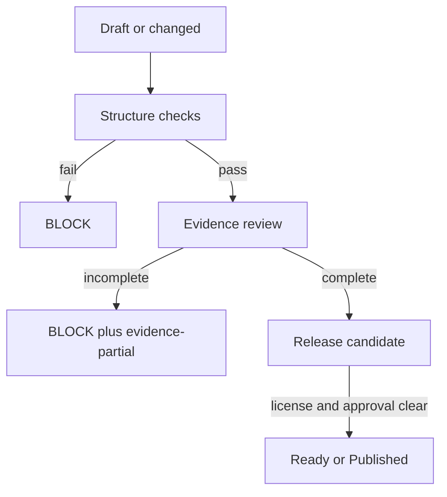

# Release State Machine

## 为什么拆成四个状态

`release_status` 只回答“当前 scope 能不能进入发布闸”，不能代表内容成熟度或证据完整度。母库和每个子库都必须同时记录：

| 字段 | 允许值 | 含义 |
|---|---|---|
| `maturity_status` | `draft` / `validated` / `stable` / `deprecated` | 内容和能力是否达到对应成熟度 |
| `verification_status` | `unverified` / `structure-pass` / `evidence-partial` / `e2e-pass` | 当前验证证据覆盖到哪一层 |
| `release_status` | `BLOCK` / `Preview` / `candidate` / `Ready` / `Published` / `retired` | 这一次发布 scope 的闸结果 |
| `license_status` | `pending` / `cleared` / `restricted` / `unknown` | 许可证、来源和再分发权状态 |

`BLOCK` 是安全闸结果，不是“内容很差”；`Preview` 只允许公开试用和单样本验证；`structure-pass` 也不是“可以稳定交付”。

## 允许组合



- `maturity_status: draft` 可以和 `verification_status: evidence-partial`、`release_status: BLOCK` 同时出现。
- `release_status: Preview` 可以公开仓库和 prerelease，但 README 必须明确非 Stable、先单样本、生产动作需批准；正式 release validator 仍只接受 `Ready` 或 `Published`。
- `maturity_status: validated` 至少需要结构检查和最小运行证据；不能仅凭文件齐全得到。
- `maturity_status: stable` 至少需要 `verification_status: e2e-pass`、许可证已清除、独立环境安装/升级/回滚证据和人工批准。
- `release_status: Ready` 或 `Published` 时，`license_status` 不得为 `pending`、`restricted` 或 `unknown`；发布 validator 必须阻断不满足者。
- `skill_status` 是条件性附加字段，不替代 `release_status`；`SKILL.md` 只能在 manifest 声明 `skill_entrypoint` 时成为交付物。

## 母库与子库分别判定

母库的 `Ready` 只批准母库 scope；某个子库的 `Ready` 只批准该子库 scope。registry 只能反映子库 manifest 的当前状态，不能替代子库验证。

正式 workflow 必须先用 `scripts/resolve-release-scope.mjs` 将触发 tag 解析成唯一 scope：母库只接受当前版本的 `mother/v...`，子库只接受 registry 中唯一匹配且版本一致的 `sub-library/<id>/v...`。普通验证 workflow 不运行正式 release gate；手工正式 gate 也不得一次遍历母库和全部子库。路由 PASS 只证明 scope 选择正确，不改变任何 manifest 状态。

## Formal Qualification 不是 Published

正式 workflow 的输出状态最多是 `qualified-artifact`：它表示 trusted workflow、唯一 scope、signed canonical tag、approval binding、sidecar/evidence、release checks 与冻结 artifact 在该次 run 中绑定到同一 candidate identity；archive 已解包复验，并由 `sha256-canonical-tree-v1` 证明原 candidate、workflow 解包树与 attestation 解包树等价。母库 runtime 状态只能是 `runtime_not_applicable`；子库 runtime 才需要 candidate implementation allowlist、trusted tests、临时 subject、外部固定 digest 的只读断网测试容器和精确计数。它不自动把 `release_status` 改成 `Ready/Published`，也不自动创建 GitHub Release。

信任链必须从 candidate 外部建立：

```text
Protected Environment + pinned workflow SHA + trusted signer allowlist
  -> trusted governance checkout
  -> independently checked candidate tag checkout
  -> sidecar and single-scope release checks
  -> digest-named qualification artifact
  -> explicit publication decision
```

若 Environment、branch/tag ruleset、trusted SHA、signer allowlist、canonical annotation 与 approval binding、跨 job candidate commit/tag object/signer/annotation 绑定、archive 解包复验/tree digest attestation 或服务端 run 证据任一缺失，正式发布资格保持 `BLOCK`。对声明 runtime contract 的子库，runtime image digest、隔离 profile、candidate implementation 来源隔离、可信 npm 控制面与直接 Node 测试计数同样是硬闸；母库则必须明确 `runtime_not_applicable`，不能因没有 runtime tests 而伪造 PASS。

## 更新同步顺序

改动任何能力或边界时，按以下顺序更新并检查：

1. 真实合同和源页面：`MANIFEST.md`、`RUNTIME-CONTRACT.json`、`AGENTS.md`、模块 README；
2. 子库 `VERSION.md` / `CHANGELOG.md`；
3. `sub-libraries/registry.json`；
4. 母库 `wiki/index.md`、模块索引和 `sub-libraries/README.md`；
5. 根 `README.md`、`CLAUDE.md`、`AGENTS.md` 的薄入口；
6. 运行母库和目标子库 validator、构建 candidate，并保留审计记录。

如果机器 registry 与 manifest 不一致，校验失败；不要用人工 README 的表格覆盖机器真源。

## 人工批准事件与 tag 隔离

结构校验、候选包校验和人工发布批准是三个不同闸门。`approval_status: pending` 即使与 `STRUCTURE_PASS`、`ARTIFACT_PASS` 同时出现，也不得解释为已批准。

- 母库固定使用 `tag_namespace: mother`、`tag_prefix: mother/v`；例如 `mother/v0.1.1-draft`。
- 子库固定使用 `tag_namespace: sub-library/<package_id>`、`tag_prefix: sub-library/<package_id>/v`；例如 `sub-library/website-content-ops/v0.3.2-preview.1`。
- 禁止用裸 `v<version>`、母库 tag 发布子库、子库 tag 发布母库，或用一个 scope 的 approval 记录覆盖另一个 scope。
- 人工批准记录作为候选包旁路 sidecar，不放进参与 `content_digest` 的源码文件，避免“批准记录修改自身摘要”的循环依赖。母库和目标子库必须分别提供自己的 `RELEASE-APPROVAL.json` 与 scope-bound `RELEASE-EVIDENCE.json`；记录必须绑定候选包的 `source_commit`、`content_digest`、`MANIFEST.json` SHA-256、`SHA256SUMS` SHA-256 和 `validation.evidence_digest`。两类候选 manifest 都必须证明每个入包源文件的 package path、repository-relative path、SHA-256 与该 commit 的 blob 内容一致；普通 working-tree 候选即使可构建，也不能被批准为可由 commit 重建。
- 正式 workflow 使用 trusted root `scripts/validate-release-approval.mjs` 校验完整 sidecar/evidence；`approved_by` 不得包含 AI、assistant、agent、bot、Codex、Claude、system 等身份 token，且 `approved_at` 必须为 UTC ISO-8601。该字符串闸只阻止显式冒充，输出 `APPROVAL_RECORD_PASS` 不等于已密码学证明真人身份。
- builder 只能执行 `--prepare`，不接收 `--approval` 或 `--evidence`。formal validator 通过 `RELEASE_APPROVAL_PATH`、`RELEASE_EVIDENCE_PATH`、`RELEASE_SOURCE_ROOT`、`RELEASE_TRIGGER_TAG` 与 `RELEASE_ACTUAL_TAG_*` 环境变量读取旁路记录和真实 tag receipt；它必须验证 annotated tag object、target commit、signer fingerprint、canonical annotation、approval binding 及跨 job identity。随后 archive 解包复验和 tree-equivalence attestation 才能形成 `qualified-not-published` 制品。未来不可 retarget 仍依赖远程 tag ruleset 和真实服务端证据。

批准记录的最小结构：

```json
{
  "schema": "release-approval/v1",
  "approval_id": "APR-20260728-MOTHER-0001",
  "decision": "approved",
  "scope": {
    "kind": "mother-library",
    "id": "b2b-export-ai-workbench-mother-library",
    "package_kind": "mother-library-release-candidate",
    "version": "0.1.1-draft"
  },
  "source": {
    "commit": "<40-char-lowercase-git-sha>",
    "dirty": false
  },
  "candidate": {
    "content_digest": "<candidate-MANIFEST-content_digest>",
    "manifest_sha256": "<candidate-MANIFEST-sha256>",
    "sha256sums_sha256": "<candidate-SHA256SUMS-sha256>",
    "immutable_locator": "<immutable-release-artifact-locator>"
  },
  "validation": {
    "profile": "mother-release-v1",
    "evidence_digest_algorithm": "sha256-canonical-json-v1",
    "evidence_bundle": "RELEASE-EVIDENCE.json",
    "evidence_digest": "<validation-evidence-sha256>",
    "completed_at": "2026-07-28T12:00:00Z"
  },
  "approval": {
    "approved_by": "human-reviewer-id",
    "approved_at": "2026-07-28T12:00:00Z",
    "basis_ref": "<human-review-record-reference>"
  },
  "tag": {
    "name": "mother/v0.1.1-draft",
    "target_commit": "<40-char-lowercase-git-sha>"
  }
}
```

验证命令：

```bash
node scripts/validate-release-approval.mjs \
  dist/mother/latest \
  /path/to/RELEASE-APPROVAL.json \
  /path/to/RELEASE-EVIDENCE.json
node sub-libraries/website-content-ops/scripts/validate-release-approval.mjs \
  sub-libraries/website-content-ops/dist/latest \
  /path/to/RELEASE-APPROVAL.json \
  /path/to/RELEASE-EVIDENCE.json
```

母库和子库的 evidence 文件名都必须与各自 sidecar 的 `validation.evidence_bundle` 一致；摘要算法固定为对 JSON 对象键递归排序、无额外空白的 `sha256-canonical-json-v1`。记录缺失、evidence 内容与摘要不一致、profile/scope/source/candidate 不一致、候选文件未完全 commit-bound、repository-relative path 串线、tag namespace 串线或 `approved_by` 含 AI/system 身份 token 时，结果必须为 `BLOCK`；不得通过手工编辑 `MANIFEST.json` 或省略 `--release` 绕过。可信真人身份与 evidence 的远程来源仍由独立批准渠道、GitHub run 和 Protected Environment 实证负责，不能由名称字符串或本地 fixture 单独证明。
